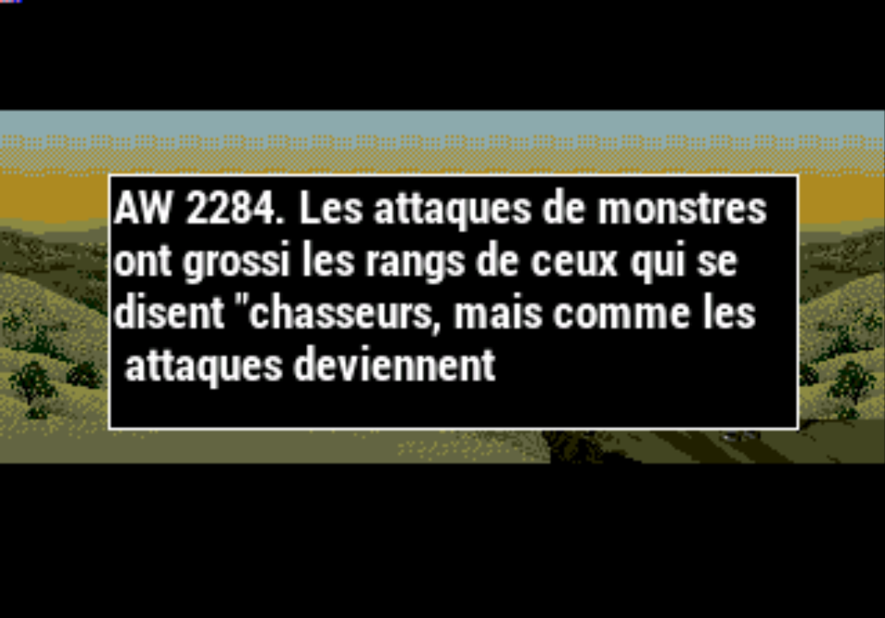

# In-game translation \(Retroarch AI\)

## What is Retroarch AI?

Welcome to the future!   
  
RetroArch uses a translation service called **"OCR"** \(Optical Character Recognition\) and **Speech Synthesis**, which will allow you to translate your foreign games almost instantly!

>This function requires an internet connection!
{.is-danger}

## Settings :

we have done everything in our power to make this kind of service as simple as possible.

>This service requires registration to an API.
>
>Recalbox will use [Ztranslate.net ](https://ztranslate.net/),  but other APIs can be configured!
{.is-warning}

* Once registered and connected to the site, go to the settings section to retrieve your `API KEY`
* Open your file `recalbox.conf`
  * Search for the line`;global.translate.apikey=YOUR_API_KEY_HERE`
  * Ersae the character `;` then enter your `API KEY` in place of `YOUR_API_KEY_HERE`

>Recalbox will automatically detect the language of your game and translate it into the language set in the main menu.
{.is-success}

## Let's Play !

Treat yourself and forget the frustration by launching a 100% Japanese game 😆

* To activate the translation, there's nothing simpler press`HOTKEY + Left-Joystick Down` , the game is paused and shows you an image with the replacement text.
* Press the AI ​​Service shortcut key again to resume the game.

By default Recalbox uses image mode rather than text-to-speech.  
To use the latter, you'll have to do a simple configuration overload!

