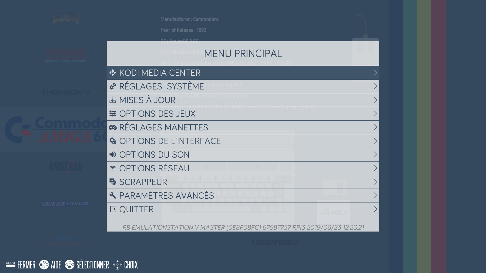

# EmulationStation

## Presentation

>When you **start** the Recalbox, you can access the **EmulationStation** \(ES\) interface. 
>
>This allows you to **launch your games**, adjust certain **options** or **update** the Recalbox.
{.is-info}

The **first** screen is the **system** screen :

​It shows all **available** systems with games inside.

## Settings

By Pressing Start, you will be able to change some system settings.

### Kodi Media Center

Start Kodi Media Center \(aka XBMC\). 

>You can start Kodi from the Home screen by pressing the **X** button on your controller. 
{.is-info}

To exit Kodi, select "QUIT" in the program, and you will be back in EmulationStation. 

Controllers are supported in Kodi. But if you prefer, you can also use HDMI-CEC \(allows you to use your TV's remote control to navigate Kodi\) or a smartphone remote control application. 

>For more information on Kodi:   
>Kodi in recalbox.  
>Use an infrared remote control.
{.is-warning}

### System Settings

Here you can access **system information**, **language selection**, **overclock settings**, **updates settings** and **kodi settings**. You can change the overclock of your RPI.   
  
The overclock speed order for RPI1 is :   
_NONE_ &lt; _HIGH_ &lt; _TURBO_ &lt; _EXTREME._  
  
Extreme may void your warranty but is **the only one** that will give you really good performance for all emulators on RPi1.

It is also recommended to overclock your RPi2, if you want emulate the N64 and have the best gaming experience.

### Update

Her you can activate or not the updates and choose if we want to install only stable versions or also the beta versions of Recalbox.

### Game settings

You can set game options : 

* **Video ratio:**

  Auto; Retroarch configuration; Provided by the core; pixel; Specific Retroarch; 1/1; 16/10; 16/15; 16/9; 12/19; 19/14; 2/1; 9/21; 3/2; 3/4; 30/17; 32/9; 4/1; 4/3; 5/4; 6/5; 7/9; 8/3; 8/7; 9/16

* **Image smooth**, Allows to give a little blur effect to the pixels so that it looks prettier on our modern TVs.
* **rewind,** This option allows you to turn back time in games and rewind for 30 secondes.

>This feature may slow down some emulators \(PS1, Dreamcast, ...\) if you activate it on these emulators. You can choose to activate it only for certain emulators via the Advanced settings menu.
{.is-danger}

* **auto save/load**. Lets you resume a game where you were when you left the game previously.  
* If you want to return to the title screen of this game, use the [special command](during-the-game.md#special-commands) **reset.** You can enable it by emulator in [recalbox.conf](the-recalbox.conf-file.md) 
* Press twice to quit the game: Confirms that you want to quit the current game. 
* You can also easily configure **shaders** for your systems. The **shader set** configuration contains the shader sets available for recalbox. 
  * The **scanlines** shaders enable scanlines on all systems to look like a CRT television. 
  * The **retro** shaders is a set of the best shaders, chosen by the community, that will offer you the closest to original gaming experience ! More info on Shaders configuration page.

>You can also switch _shaders_ in-game using your controller. Use the [Special commands](during-the-game.md#special-commands) Hotkey + R2 or Hotkey + L2 to see the next or previous shader.
{.is-info}

* **Integrate Scale** \(Pixel Perfect\): Displays the games in their original resolution. 
* **Retroachievements** options: Allows you to configure Retroachievements \(Equivalent to achievements / trophies but for old consoles\). 
* **NetPlay** options: Allows you to configure the NetPlay \(online game\).

### Controller settings

In this screen you can customize your controller mappings and order.

### UI settings

You will have access to the frontend setting. 

* **Screensaver:** Configuration of the screensaver with different options. 
* **Clock in the menu** 
* **Help display** 
* **Adjust popups** 
* **Quick system selection :** Allows you to switch from one system to the next system using the right or left keys. 
* **Virtual keyboard** 
* **Theme:** Choice of different themes created by the community \(These new themes are not available by default with Recalbox\)

See Overscan settings for more information.

### Sound settings

You can enable or disable **background sounds** in Emulationstation, set **system volume** and choose **output device** \(_auto_, _jack_ or _hdmi_\).  
  
Select jack to force analog output.

### Network settings

You can enable and configure the **wifi** and the **hostname**, get the recalbox **IP.**  
  
Type the SSID of your network and the network key with a keyboard. Once you validate, the wifi is activated. 

>A known bug exists that does not allow you to enter all the characters you need for the SSID or the Key.   
>If you cannot enter certain special characters required for your network information you can configure this directly from your wifi using [recalbox.conf](the-recalbox.conf-file.md).
{.is-warning}

### Scrapper 

For each game, you can obtain information \(cover, summary, etc.\) which will be displayed in the game selection menu of EmulationStation. 

Press **START** and go to **SCRAPPER**. Then follow the on-screen instructions.

>In Recalbox 6.0, the Scrapper is disabled and therefore does not work.
{.is-danger}

### Advanced settings 

* **Overclock:** Overclock settings \(NONE &lt;HIGH &lt;TURBO &lt;EXTREM\)

>The Turbo and Extrem settings can cause irreversible damage to the Raspberry if they are not done in the right conditions \(heat dissipation, ventilation, ...\). Your hardware warranty may be void. 
{.is-danger}

>The ranking of overclock presets for RPi1, in ascending order of speed, gives: NONE &lt;HIGH &lt;TURBO &lt;EXTREM   
>  
>The Extrem setting may void your RPi's warranty, but it is the only one that will give you good performance with all RPi1 emulators. 
{.is-warning}

>It is also advisable to overclock the RPi2 if you want to emulate the N64 and get the best gaming experience. 
{.is-info}

* **Startup parameters:** Different startup parameters. 
* **Advanced emulator configuration:** Allows you to configure the emulator options independently from the others. 
* **Kodi options**
* **Security:** Reinforce the security of Recalbox and change the root password. 
* **Overscan** 
* **Display frequency** 
* **Recalbox Manager** 
* **Recalbox API**

### **Quit**

Use this to shut down your Recalbox.

## Controls

**Frontend commands :**

* A ****→ Select
* B → Back
* Y → Switch Favorite on the roms list, contextual help in a menu
* X → Launch Kodi
* Start → Menu
* Select → Options \(reboot menu on systems screen\)
* R → Next Page
* L → Previous Page

When you select a system with A, the screen changes and shows all available games.

When the game is running, go to the section [_During the game_](during-the-game.md) to see how you can go back to the frontend.

## Favorites

You can set a game as a favorite by pressing the **Y** button. The game will be on top of the game list with a controller icon before its name. 

>You have to **reboot** the system **properly** within the **EmulationStation** menu to **save your favorites** and then find them in the **next startup**.
{.is-warning}

