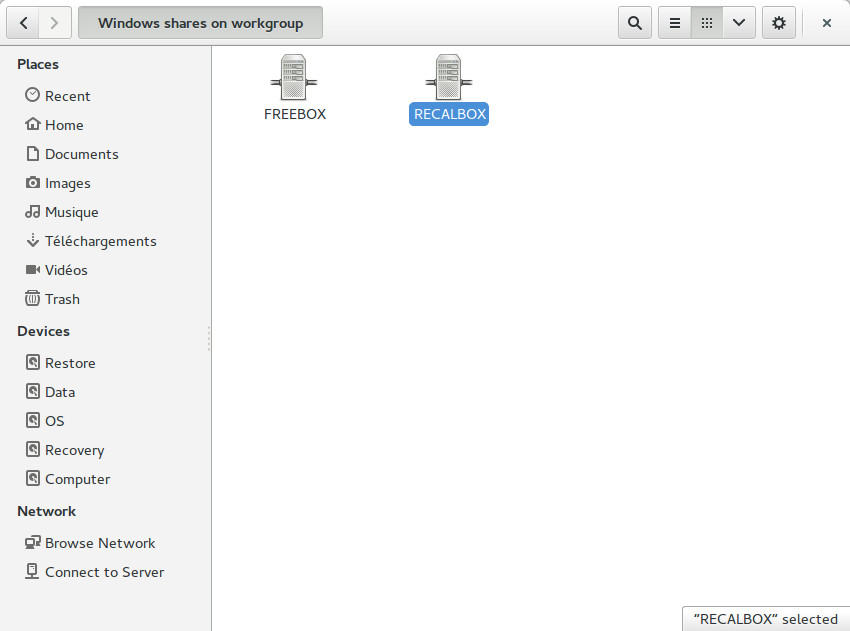
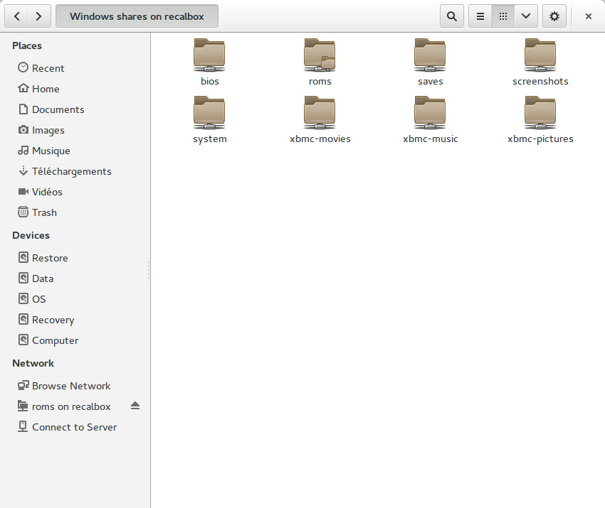

# Network features


>When you **configured the wifi** or **plugged an Ethernet cable** on the recalbox, it automatically shares folders on the local network. 
>
>
>On your computer, got to Network on Windows explorer, and select the recalbox :
>
>
>
>
>If you don't see your **Recalbox** in your network, try to type **\\RECALBOX** in the explorer address bar. 
>
>If it doesn't work:
>
>* Go in the recalbox menu, 
>* **NETWORK SETTINGS**
>* Note down your IP. 
>* Then type it in the explorer address bar,  \(for example **\\192.168.1.30\)**
>
>If it still doesn't work and you're on Windows 10:  
>-lien manquant-
>
{.is-info}

You can access all recalbox **shared folders** 



## ​LA SECTION FR S'ARRETE LA


ALTERNATIVE:

You can open recalbox in your webbrowser at [http://recalbox/](http://recalbox/) or [http://recalbox.local/](http://recalbox.local/) or using the actual ip, for example [http://192.168.1.30](http://192.168.1.30/). There you can see the system status, configure recalbox and also upload ROMs and BIOS.

Depending on your recalbox installation you can also use the new user-friendly web-based manager 2.0 - [https://www.recalbox.com/blog/en/post/blog-2017-03-06-manager2/](https://www.recalbox.com/blog/en/post/blog-2017-03-06-manager2/)​

## Add your games

Just copy the files in the corresponding folder. You can use either _.zip_ files \(for supported systems\) or uncompressed roms. To refresh the game library, go to the **Menu**, then **Games Settings** then **Update Games Lists**

Don’t hesitate to talk about your favorite games in the recalbox forum ! [https://forum.recalbox.com/](https://forum.recalbox.com/)

## Arcade games

​If you want to add arcade games on your recalbox, you should read the mini how to \[\[Easy Arcade on Recalbox\|Easy-Arcade-on-Recalbox-\(EN\)\]\] and learn how to \[\[check your roms version\|Check-your-roms-version-with-clrmamepro-\(EN\)\]\]. Then you can also enable the \[\[Neogeo Unibios\|Use-Neogeo-Unibios-\(EN\)\]\] to have more options with your games.

## Scummvm games

When you add a Scummvm game, create a folder with the name of the game followed by the ".scummvm" extension and copy files of the game in it. In this folder, you will have to add a single file, named \[gameshortname\].scummvm

You can find short names for all supported games at [http://scummvm.org/compatibility/](http://scummvm.org/compatibility/)​

For example, you can copy the game "Broken Sword" in the directory "Broken Sword 1.scummvm" under the scummvm directory. In this folder create a file named sword1.scummvm

```text
scummvm|- Broken Sword 1.scummvm|  |- sword1.scummvm|  |- ... other files of the game
```

The name of your directory will be displayed as the name of the game in Recalbox menu. Selecting it will start the game.

You can quit the game and get Scummvm options by using the _Ctrl_ + _F5_ shortcut.

## Screenshots

Press Hotkey + L1 in emulators to take a screenshot. The png file is saved in the "screenshots" directory, you can access it on the network or with the webmanager. Share your best screenshots with us on [http://blog.recalbox.com/forums/](http://blog.recalbox.com/forums/)​

## Backup your saves

The _saves_ folder share contains all saves and saved states. You can copy all the files if you want to secure them.

