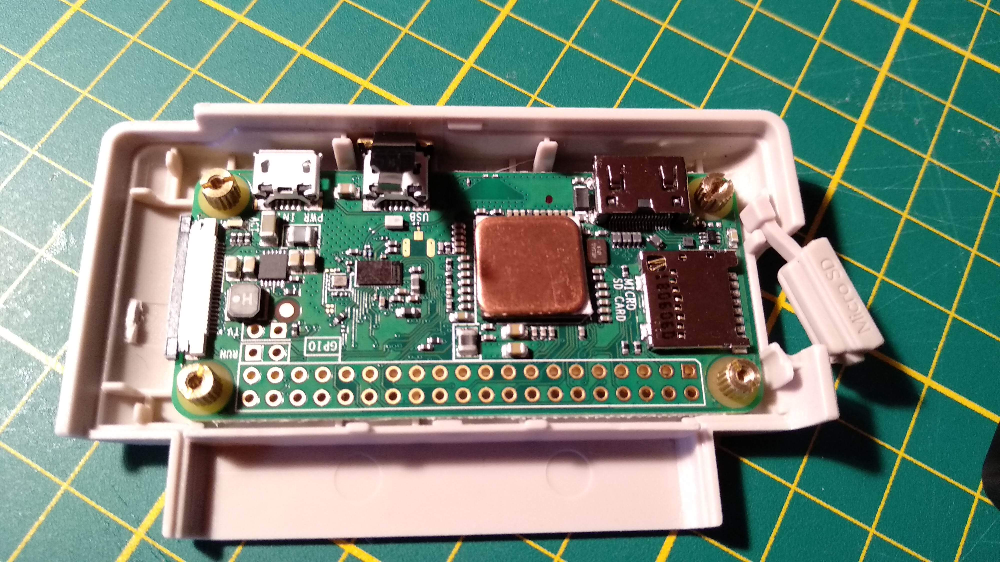

# RetroFlag GPi Case

## Preparation

### What you need

* 1 x RetroFlag GPi box 
* 1 x Raspberry Pi Zero W 
* 1 x SD card 
* 1 x SD card adapter 
* 1 x Heat sink \(for your RPI ZERO W card\) 
* 3 X Batteries

### Recommended batteries

* Duracell Recharge Ultra Rechargeable type AA 2500 mAh  5 or 6h autonomy  [https://www.amazon.fr/dp/B00E3DVQFS?ref=ppx\_pop\_mob\_ap\_share](https://www.amazon.fr/dp/B00E3DVQFS?ref=ppx_pop_mob_ap_share) 
* Panasonic BK-3HCDE / 4BE eneloop pro 2500mAh Set of 4 AA-Mignon / LR6 Ni-MH batteries  [https://www.amazon.fr/gp/product/B00JWC40JY/ref=ppx\_yo\_dt\_b\_asin\_title\_o03\_s00?ie=UTF8&psc=1](https://www.amazon.fr/gp/product/B00JWC40JY/ref=ppx_yo_dt_b_asin_title_o03_s00?ie=UTF8&psc=1)   With a 10,000mAh external battery, the fun will never stop.

## Just flash and boot!


It's that simple! _**Recalbox detects and installs automatically everything required**_ to make your GPi case working fine.

Just flash your SD card with the latest Recalbox image for Raspberry Pi1 / Pi0, insert the SD card into the GPi cartridge, and switch your GPi on!

Wait for a few seconds, then you should see the following image on screen:


Wait a few more seconds \(this can be longer for large SD cards\) until EmulationStation starts with its usual screen:


Then, enjoy an optimized theme to make your experience rich, smooth and fun!

## What's different from a regular Recalbox?

When Recalbox detects and installs all GPi case stuffs, it also changes some settings to let you go playing quickly.  
Obviously, all settings are available through the **START** menu and you can still change back what you want.

Here is the list of the modified settings:

### Here is a list of the changes: 

* All videomode are set to `default` to avoid unnecessary HDMI resolution changes

* GPI hostname is configured to **RECALBOXGPI**

* Kodi and the X button are disabled

* Virtual controller is disabled

* Updates are disabled

* Netplay is disabled

* Bluetooth is disabled

* XArcade & PS3 drivers are disabled

* The musical popup is deactivated

* The XBOX360 configuration has been replaced by that of the GPI \(Yes, the GPI controller is also an XBOX360 controller!\)

* Our optimized recalbox-gpicase theme is already copied to`/recalbox/share/themes`  and activated

### Are also installed: 

*  dpi-pizero-gpicase.dtbo: GPI screen driver 
* pwm-audio-pizero-gpicase.dtbo: GPI sound driver 
* A special shutdown script for the GPI, originally made by Retroflag and strongly modified so that the GPI quickly shuts down. 

## Setup WIFI connection 

You can still use the START menu, go to the network submenus and configure the WIFI. 

However, on the GPi, you have no choice but to use the controller and the virtual keyboard to enter your WIFI password. If your password is complex, this can quicky turn into a painful task.

Here's a quick, step-by-step solution :

* Flash and boot your GPi. When EmulationStation is up, press **START,** go to the network menu, enable the WIFI and select your SSID. 
* Turn off your GPi using the **SELECT** menu / Shutdown option,  and _wait for Recalbox to turn off!_ 
* Remove the SD card and access the **BOOT** partition on your PC. 
* Open the file recalbox-backup.conf, go to line starting with`;wifi.key =`   
* Remove the `;` and add your WIFI password after the `=`. 
* Save , insert the SD card into the GPI and restart it. 
* Once EmlulationStation is up, you should be connected to your WIFI 
* Open \\recalboxgpi\share\system\recalbox.conf and make the same operation with the line `; wifi.key =` 
  * You may change this file using nano via an SSH connection. 
* Save. That's it, you are ready to go!

## Installing games


Now that you are connected, you can install your games as usual, using SAMBA \(`\\recalboxgpi\share` in a file browser\) or through the WebManager \(`http://recalboxgpi` in a web client\).   
  
If your GPI is not connected, and you are running Windows on your PC, you can: 

* Boot on a linux live-CD, and have access to your disks as well as to the partition partition of your SD card, so that you can copy what you want on the SD card. 
* Install Paragon Software to be able to access the EXT4 linux partition of the SD card \([https://www.paragon-software.com/fr/home/linuxfs-windows/](https://www.paragon-software.com/fr/home/linuxfs-windows/)\)  
* Install partitionguru 4 

Have fun with your favorite games!

## What you should know...

### What game can I run on a GPi case?


>_**You can run any 8/16 console/computer available up to Arcade games**_.  
>_**Yes you can! Really :-\)**_
{.is-info}

For arcade you have **PiFBA,** an ARM optimized FBA version that require a 0.2.96.37 romset.  
**FBNeo** \(formerly FBAlpha\), **MAME2000** up to **MAME2003plus** run pretty smoothly and most of games are playable.

Some **GBA/SNES** games, as well as Arcade games, may suffer some lags or slowdown. In such case, you may want to disable the rewind option in Emulator Advanced Options.   
Needless to say, even with optimized options, a small handful of game won't run at full speed.


>For obvious reasons, We do not recommend to install computer games as they often require a keyboard or a mouse to be played.
{.is-warning}

### 

### Can I overclock my Pi0?

Unfortunately, the Raspberry Pi0 is not easy to overclock. Moreover, the GPi cartridge does not have air vents to let the hot air out \(At least on the GPi v1 case that we are using at the time of writing this\).

_**However you can still modify the O/C options at your own risk!**_


>If your GPi is not stable after selecting an O/C option, to the point that you cannot revert to your settings, insert your SD card into a PC adapter and remove the O/C lines from the file `config.txt`
{.is-danger}

You can add a small copper heatsink as shown in the following picture. Its thickness must not exceed 2mm.



### 

### How long can I play on battery?

First tests tend to show that you can play for approximately 2h.

Dont forget your GPi also has an USB power cord. In a car or at home,  use the USB cord.


>If the cartridge gets too hot, we recommend you to stop your GPi and let it cool down a while.
{.is-info}

### 

### How can I scrape my games?

For just a few games you can still use the internal scraper. However, the internal scraper is configured to save large images for a regular Recalbox. Using the internal scraper on a WIFI connection may be slow and inefficient.

_**We really recommend to use an external scraper**_. It'll faster and better quality. You may also configure image max size to 170x170 to save space and improve the speed in EmulationStation.

## Troubleshootings

* If the display turns black or jumps when you touch the cartridge or move the console: 

  * Check all the connections. 
  * Get the rpi in the cartridge closer to the printed circuit:  - Play with the 4 studs that support the Pi 0 unscrewing them slightly until the Pi 0 is perfectly parallel with the cartridge. - Depending on the case, unscrewing the 2 golden studs from the top may be sufficient.


>**Note :**   
>This bug might occurs during the cartridge machining if the connection between the Pi 0 and the cartridge is not made correctly.
{.is-warning}

* **Solve stability problems** 

  * **1 - Micro-SD**  Check your microSD. Some models have problems with Pi, not to mention the poor quality Chinese µSd. Test with another SD, preferably from another brand. 
  * **2- The batteries**  _**Do not install the GPI on batteries!**_  Always use the USB cord for installation and initial testing.  If it works properly with the cord and not with the batteries, either they are discharged or they do not provide enough juice, despite the GPI regulator.  Most rechargeable batteries are 1.2V, not 1.5V. 
  * **3 - The model of Pi0.**  It seems that some models have stability problems, at least with the original clocks, configured with the Pi's firmware \(it's a shame!\).  Open the `config.txt` file in the FAT32 partiton, and add the following lines to the end of the file: 

  ```text
  arm_freq = 1000 
  gpu_freq = 500 
  core_freq = 500 
  sdram_freq = 500 
  sdram_schmoo = 0x02000020 
  over_voltage = 6 
  sdram_over_voltage = 2 
  ```

It will force the configuration of the clocks with a slight overclocking of the GPU as a bonus.  


* * **4 - Assembly**  Although the assembly of the Pi is relatively easy, it could be that your assembly induces imperfect contacts. Disassemble the cartridge, clean the contacts of the Pi and the GPI with an alcohol-based cleaning solution, reassemble the Pi.  Also clean the cartridge contacts in the GPI. Check that the cartridge is properly inserted. The ignition button must not force either on or off. If it forces, it is because your cartridge is inserted incorrectly, or something is blocking it. 
  * **5 - Finally ...**  If after all that, it doesn't work, or if it's still unstable, try another Pi to determine if the Pi or GPI is faulty. Get an other one, or given the price you could buy another.  If the GPI is at fault, you can try an exchange or taken back. If you have any concerns with the seller, give them the entire procedure you followed in order to prove your good faith regarding the incrimination of the GPI.

If you're in the following situation:

* On first boot, there is nothing on the screen after a reasonable amount of time
* You cannot set up the WIFI connection

Contact us on Discord or on the Forum and give us the following files, available from the BOOT partition on your SD card:

* `config.txt`
* `recalbox-backup.conf`
* `hardware.log`


>For any other issue, please use the regular channel:   
>Forum or Gitlab issues
{.is-danger}

