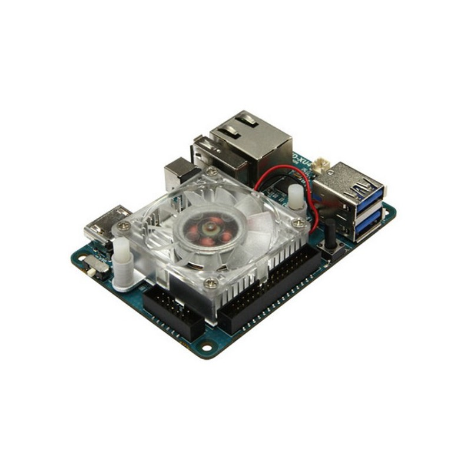
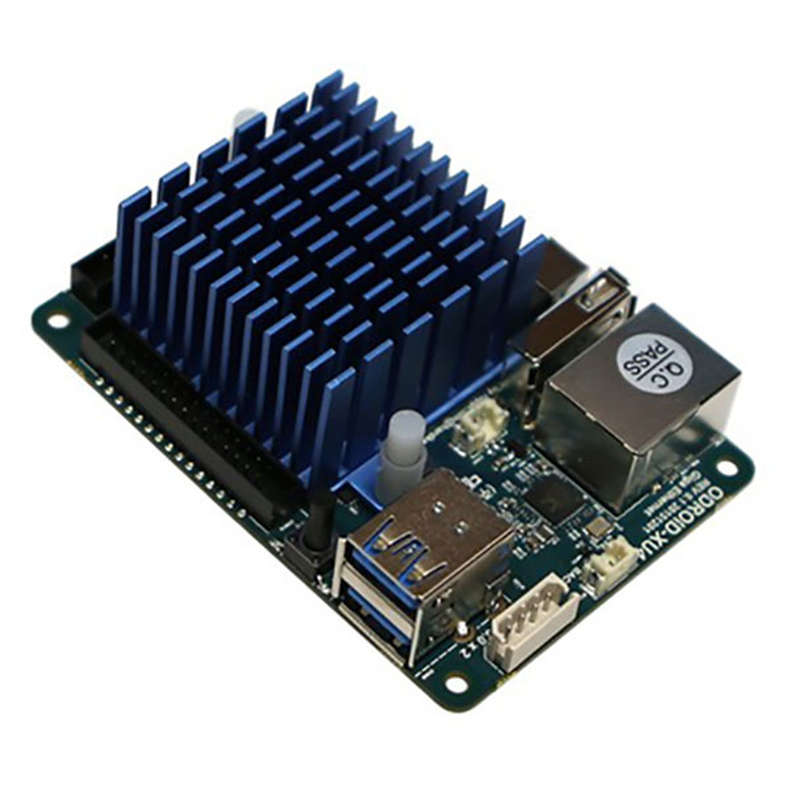

# Odroid

## Odriod XU4

ODROID-XU4 is a new generation of computing device with more powerful and more energy efficient hardware and a smaller form factor. 

Implementing the eMMC 5.0, USB 3.0 and Gigabit Ethernet interfaces, the ODROID-XU4 offers incredible data transfer speeds, a function that is increasingly required to support the advanced processing power of ARM devices. 

This allows users to truly experience a computer upgrade, especially with faster startup, web browsing, networking, and 3D games. 

### Characteristics 

* **CPU :** Exynos 5422 \(ARM Cortex-A15 Quad-Core clocked at 2.0 GHz / ARM Cortex-A7 Quad-Core clocked at 1.4 GHz\) 
* **GPU :** Mali ™ -T628 MP6 3D Accelerator \(OpenGL ES 3.1 / 3.0 / 2.0 / 1.1 and OpenCL 1.2 Full profile\) 
* **RAM :** 2GB LPDDR3 PoP RAM \(750Mhz, memory bandwidth 12GB / s, 2x32 bit bus\) 
* **Connectors :** 
  * 1 X RJ45 Female 
  * 1 X USB 2.0 
  * 2 X USB 3.0 
  * 1 X HDMI MicroSD card slot \(up to 128 GB\) 
* **Additional :** 
  * Storage \(Option\) eMMC module plug: eMMC 5.0 Flash storage \(up to 64 GB\) 
  * HDD / SSD SATA interface \(optional\) SuperSpeed ​​USB adapter \(USB 3.0\) to Serial ATA3 for 2.5 "/ 3.5" HDD and SSD storage Network 
  * USB sound card \(Option\)
  * WiFi \(Option\): USB IEEE 802.11 ac / b / g / n 1T1R WLAN with antenna \(external USB adapter\) 
* **Network :** Ethernet LAN 10/100 / 1000Mbps Fast Ethernet with RJ-45 socket \(Auto-MDIX support\) 
* **Power supply :** 4,8Volt ~ 5,2Volt \(5V / 4A recommended\) 
* **Dimension :** 83 x 58 x 20 mm 
* **Weight :** 38 gr \(without cooler approx\).

## Odroid XU4Q

Whether you want to build a media center, a game console, an on-board surveillance system or anything else, the ultra-compact **Odroid XU4Q** motherboard will be an ideal choice.

Embedding a Samsung Exynos 5422 Octo-Core 2.0 GHz processor and 2 GB of RAM, it is a very affordable solution. 

As for the heat sink already mounted on the card, it will rotate only when the CPU load is high and the temperature reaches a minimum threshold.

### Characteristics 

* **CPU :** Samsung Exynos 5422 \(ARM Cortex-A15 Quad-Core clocked at 2.0 GHz / ARM Cortex-A7 Quad-Core clocked at 1.4 GHz\) 
* **Number of cores :** 8 
* **GPU :** Mali T628 MP6 OpenGL ES 3.1 / 3.0 / 2.0 / 1.1 and OpenCL 1.2 
* **RAM :** 2 GB LPDDR3 
* **Connectors :** 
  * 1 X RJ45 Female 
  * 1 X USB 2.0
  * 2 X USB 3.0 
  * 1 X HDMI Female 
  * microSD card, micro SDHC, micro SDXC \(compatible\) 
* **Additional :** 
  * 1 X GPIO 12 pins \(header\) 
  * 1 X GPIO 30 pins \(header\) 
* **Network :** Ethernet LAN 10/100/1000 Mbps 
* **Power supply :** 5V / 4A \(transformer not supplied\) 
* **Dimensions :** 83 x 58 x 20 mm 
* **Weight : 38g** 
* **Integrated heat sink** 
* Full source code accessible on Github

