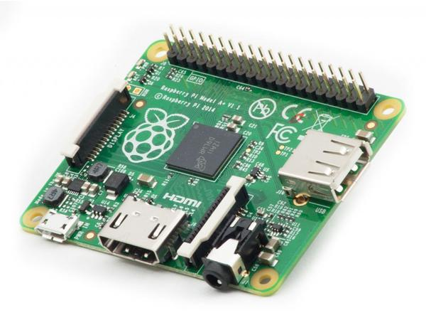
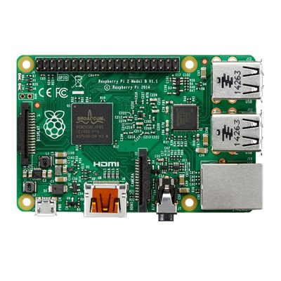
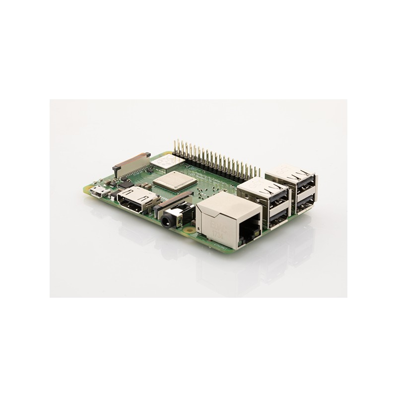

# Raspberry Pi

Le Raspberry Pi possède un processeur ARM. Il inclut 1, 2 ou 4 ports USB, un port RJ45.  
Son circuit graphique BMC VideoCore permet de décoder des flux Blu-Ray full HD \(1080p 30 images par seconde\), d'émuler d’anciennes consoles et d'exécuter des jeux vidéo relativement récents.

## Accessoires supplémentaire nécessaire

* Alimentation
* Boîtier
* Carte SD

## Raspberry Pi Zero v1.3

Le premier ordinateur à 5 $! Le Raspberry Pi Zero ultra-petit et ultra-mince est le plus petit facteur de forme du Raspberry Pi sur le marché. Il est 40% plus rapide que le Raspberry Pi d'origine mais ne mesure que 65 mm de long par 30 mm de large et 5 mm de profondeur.  
Le Raspberry Pi Zero prend en charge les mini-connecteurs pour économiser de l'espace et le GPIO 40 broches n'est pas peuplé, ce qui offre la flexibilité d'utiliser uniquement les connexions nécessaires à votre projet.

### Caractéristiques :

* **Processeur :**
  * ARM 11 Single-Core 1 GHz,  Broadcom BCM2835 1GHz
* **RAM :**
  * 512MB
* **Stockage :**
  * Micro-SD Slot
* **Connectiques :**
  * 1 X ****USB for data \(On-The-Go ports\)
  * 1 X Mini HDMI
  * 1 X Micro-USB power
  *  1 X CSI \(header caméra\)
  * 40 X Unpopulated pin GPIO connector
* **Dimensions :**
  * 65mm x 30mm x 5mm

## Raspberry Pi Zero W **\(Wireless\)**

Le Raspberry Pi Zero W ! est le plus petit de la famille Raspberry Pi, il dispose en plus d'une connectivité **Wi-Fi** et du **Bluetooth** intégrée !  
Avec un processeur aussi puissant que le A+ et le B+, la Raspberry Pi Zero W vous offrira de nombreuses possibilités, grâce à son design compact.

>**Attention :**  
>Vous aurez besoin d'un header GPIO 2x20 pour connecter la plupart des cartes d'extensions !
{.is-danger}

* Composite video and reset headers 

### Caractéristiques :

* **CPU :**
  * ARM11, Broadcom BCM2835, Single-core 1GHz
* **GPU :** Intégré
* **RAM :**
  * 512 Mo \(DDR2\)
* **Connectiques :**

  * 1 X lecteur micro SD
  * 1 X mini HDMI
  * 1 X micro USB OTG
  *  \(alimentation\)

  **Additionels :** 

  * 1 X CSI camera connector 
  * Unpopulated 40-pin GPIO connector

* **Réseau :** 
  * Bluetooth 4.1, Bluetooth Low Energy \(BLE\)
  * WIFI 802.11b/g/n Wireless LAN \( 150 Mbps\)
* **Alimentation :**
  * 1 X micro USB
* **Dimension :**
  * 65mm x 31mm x 5mm

## Raspberry Pi **1 Model A+**

The Raspberry Pi 1 Model A+ Is just 56mm long, 12mm thick and uses up to 45% less power than a Raspberry Pi 1 Model B+

### Caractéristiques :

* **Processeur :**
  * ARM 700 MHz CPU
* **RAM :**
  * 256MB
* **Connectiques:**
  * 1 X Micro SD slot
  * 1 X USB 2.0
  * 40 X GPIO
* **Réseau :**
  * None
* **Dimensions:**
  * 65x56x12mm

## Raspberry Pi **2 Model B**

### Caractéristiques :

* **CPU :** 
  * 900MHz Quad-Core ARM BCM2836 Cortex-A7 CPU
* **GPU :** 
  * Dual Core VideoCore IV® Multimedia Co-Processor
* **RAM :** 
  * 1 GB
* **Connectiques :**
  * 1 X CSI Camera Port \(Video Input\)
  * 40 X GPIO Pins
  * 1 X MicroSD Storage
  * Audio/Display Output: HDMI, DSI Display Port, Component over 3.5mm
  * 4 X USB Ports \(USB 2.0\)
  * On-board Network: 10/100 Mbit/s Ethernet
* **Alimentation :** 
  * 5V MicroUSB

## Raspberry Pi 3 Modèle B 1GB

Découvrez le **Raspberry Pi 3 Modèle B 1GB** avec une **connectivité Wi-Fi** et **Bluetooth** intégrée !  
Basé sur le processeur **Quad** **Core Broadcom 2837 ARMv8 64bit** passant de 900MHz \(sur le Pi2\) à 1,2Ghz, le RPi nouvelle génération est un peu plus grand que le Pi2, plus rapide et plus puissant que ses prédecesseurs.

### Caractéristiques :

* **CPU :** 
  * Broadcom BCM2837 \(ARM Cortex-A53 Quad-Core 1.2 GHz\)
* **GPU :** 
  * ARM v8, Dual-Core _VideoCore IV_
* **RAM :** 
  * 1GB
* **Connectiques :** 

  * 1 X Jack 3,5mm Femelle Stéréo
  * 1 x Hdmi
  * 4 x USB 2.0
  * 1 x micro SD \(SDHC, SDXC\)
  * 1 X RJ45 Femelle

  **Additionels :** 

  * 1 x CSI \(header caméra\)
  * 1 x DSI \(header écran\)
  * 40 x ****GPIO

* **Réseau :** 
  * WiFi WLAN BCM43143,  Wi-Fi N 150 Mbps \(IEEE 802.11n\)
  * Bluetooth BLE 4.1
* **Alimentation :** 
  * Jusqu'à 2,5A, Micro USB

## Raspberry Pi 3 Modèle B**+** 1GB

#### La dernière génération des Raspberry Pi 3 ! 

Le Raspberry Pi 3 Model B+ possède un **processeur quad-core 64 bits** cadencé à 1,4 GHz, un r**éseau sans fil Bibande de 2,4 GHz et 5 GHz**, une **connexion Bluetooth 4.2** / BLE, une connexion Ethernet plus rapide et la possibilité d'une alimentation PoE via la PoE HAT \(non incluse\).

Le dernier Raspberry Pi 3 modèle B + possède un processeur quad core 64 bits 1,4 GHz plus rapide, 1 Go de RAM, un LAN sans fil 802.11 b / g / n / ac double bande plus rapide, Bluetooth 4.2 et un Ethernet 300 Mbit / s beaucoup plus rapide.

Avec le processeur ARMv8, il peut exécuter la gamme complète des distributions ARM GNU / Linux, y compris Snappy Ubuntu Core, ainsi que l'édition IoT de Microsoft Windows 10.

* Raspberry Pi 3 Model B+ \(B Plus\) with 1.4GHz 64-bit quad-core ARMv8 CPU \(BCM2837B0\)

### Caractéristiques :

* **Processeur :** 
  * Broadcom BCM2837B0 \(ARM Cortex-A53 Quad-Core 1.4 GHz\) /Arm 11
* **GPU :**
  * Dual Core VideoCore IV® Multimedia Co-Processor
  * Provides Open GL ES 2.0, hardware-accelerated OpenVG, and 1080p30 H.264 high-profile decode
  * Memory: 512MB SDRAM
* **RAM :** 
  * 1GB LPDDR2 SDRAM
* **Connectiques :** 

  *  1 X Jack 3,5mm Femelle Stéréo
  *  4 X USB 2.0
  *  1 X RJ45 Femelle
  * 1 x HDMI
  * 1 x GPIO \(40 pin\)
  * 1 x micro SD slot \(SDHC, SDXC\)
  * 1 x Gigabit Ethernet USB 2.0 \(300Mbit/s ethernet\)

  **Additionnels :**

  * 1 x MIPI CSI \(Camera interface\)
  * 1 x MIDI DSI \(Display interface\)
  *  1 X GPIO 40 pins \(header\)
  * 

* **Réseau :**
  * WIFI 2.4GHz et 5GHz IEEE 802.11.b/g/n/ac WLAN \( 10/100/1000 Mbps\)
  * Bluetooth 4.2 HS low-energy \(BLE\) \(CYW43455\)
* **Alimentation :** 
  * Micro USB socket 5V, 2A \(Compatible PoE nécessitant le PoE HAT non fourni\) 

## Raspberry Pi 4

Avec jusqu'à 8GB de mémoire, ce Raspberry PI4 est **le plus puissant** des PI4 et conserve des capacités exceptionnelles par rapport aux Pi3 et Pi3 modèle B+.

Il offre une augmentation sans précédent de la **vitesse du processeur, des performances multimédia, de la mémoire et de la connectivité** par rapport à la génération précédente du Raspberry Pi 3 Modèle B +, tout en maintenant la compatibilité avec les versions antérieures et une consommation électrique similaire. De plus, grâce à une révision 1.3, le Raspberry Pi 4 peut supporter une mémoire plus importante.

Pour l'utilisateur final, le Raspberry Pi 4 modèle B offre des performances de bureau comparables à celles des systèmes PC d'entrée de gamme x86.

### Caractéristiques :

* **Processeur :** 
  * ARM v8, Broadcom BCM2711, Quad-core Cortex-A72 64bit SoC@ 1,5GHz
* **GPU :**
  * VideoCore VI prenant en charge OpenGL ES 3.0, décodage HEVC 4K à 60 i/s
* **RAM :** 
  * 1GB à 8GB LPDDR4 RAM
* **Connectiques :** 
  * 1 x MIPI DSI \(Port d'affichage DSI pour connecter l'écran tactile Raspberry Pi\)
  * 2 x micro HDMI
  * 2 x USB 2.0
  * 2 x USB 3.0
  * 1 x GPIO \(40 pin\)
  * 1 x MIPI CSI \(Port caméra CSI pour connecter la caméra Raspberry Pi\)
  * 1 x micro SD
  * 1 X Jack 3,5mm Femelle Stéréo
* **Réseau :**
  * Gigabit Ethernet \(RJ45\)
  * Bluetooth 5.0
  * Wi-Fi 802.11b/g/n/ac
* **Alimentation :** 
  * 5V DC via un connecteur USB-C \(minimum 3A\), 5V DC via un en-tête GPIO \(minimum 3A\), compatible Power over Ethernet \(PoE\) \(nécessite un HAT pour PoE\)

>Il faut utiliser la prise HDMI0 \(celle qui est à coté de la prise d'alimentation\).
{.is-info}

## Raspberry Pi 400

Le Raspberry Pi 400 est basé sur un Raspberry Pi 4, un peu boosté.

Au niveau technique le Pi 400 est construit sur la base du Raspberry 4, mêmes ports, mêmes capacités graphiques, même mémoire, même alimentation, etc.  
Les ports GPIO sont bien sur conservés et facilement accessibles sur la face du clavier dédiée aux connectiques.  
Seule différence technique, la cadence du processeur qui est revue à la hausse, passant de 1.5 Ghz pour le Raspberry 4 à 1.8 Ghz pour le Raspberry 400.

La forme du Raspberry Pi 4 a également été entièrement repensée pour s’adapter à ce nouveau format, comme en témoigne cette image de la fondation.  
Autre différence, grâce à sa forme moins compacte et à l’utilisation de dissipateurs thermiques intégrés \(la partie grise de l’image ci-dessus\), ce Raspberry Pi 400 devrait beaucoup moins chauffer que le Raspberry Pi 4.

### Caractéristiques :

* **Processeur :**
  * Broadcom BCM2711 quad-core Cortex-A72 \(ARM v8\) 64 bits SoC @ 1,8 GHz
* **GPU :**
  * VideoCore VI \(OpenGL ES 3.0\)
    * H.265 \(décodage 4Kp60\), H.264 \(décodage 1080p60, encodage 1080p30\), graphique OpenGL ES 3.0
* **RAM :**
  * 4GB LPDDR4 - 3200 DRAM
* **Connectiques :** 
  * 1 x Gigabit Ethernet
  * 2 × ports USB 3.0
  * 1 × port USB 2.0
  * 1 x GPIO Tête GPIO horizontale à 40 broches
  * 2 × ports micro HDMI \(prend en charge jusqu'à 4Kp60\)
  * 1 x Emplacement pour carte MicroSD pour le système d'exploitation et le stockage des données
* **Réseau :**
  * Dual-band \(2,4 GHz et 5,0 GHz\)
  * LAN sans fil IEEE 802.11b / g / n / ac
  * Bluetooth 5.0, BLE
* **Alimentation :**
  * 5 V CC via connecteur USB-C \(5V - 3A\) - Alimentation officielle recommandée
* **Température de fonctionnement :**
  * 0 °C à + 50 °C
* **Clavier :**
  * Clavier compact à 78 ou 79 touches \(selon la variante régionale\)
* **Dimensions:**
  * 286 mm × 122 mm × 23 mm \(maximum\)

