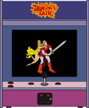

# Daphne

## Fiche technique

* **Développeurs :** Matt Ownby \(Daphne\) and Jeffrey Clark \(Hypseus\)
* **Année de sortie :** 1999
* **Website :** [http://www.daphne-emu.com/](http://www.daphne-emu.com/site3/index_hi.php) en C++
* **Daphne** est un programme qui vous permet de jouer aux versions originales de nombreuses versions originales sur LaserDisc arcade.

## Présentation

Le **LaserDisc** est le premier support de stockage optique, initialement de vidéo, à être commercialisé en 1978 en Amérique du Nord, au début sous le nom de MCA DiscoVision.

Bien qu’il offrît une meilleure qualité de son et d’image par rapport aux supports contemporains \(notamment les cassettes VHS et Betamax\), le LaserDisc n’a connu que peu de succès, en raison principalement du prix élevé des lecteurs, et du fait qu’il ne permettait pas d’enregistrer les programmes de télévision. S’il a été dès son introduction plébiscité par les détenteurs de home-cinema, c’est seulement en Asie \(Hong Kong, Malaisie et Singapour\), dans les années 1990, que le LaserDisc s’est véritablement diffusé dans les foyers.

Néanmoins, c’est à partir de la technologie du LaserDisc qu’ont été élaborés plusieurs supports de stockage optique : notamment les CD, DVD, qui ont connu un succès considérable.

### Qu'est qu'un jeu LaserDisc ?

Un jeu vidéo **LaserDisc** est un jeu qui **utilise des vidéos pré-enregistrées** \(des films ou des animations\) **jouées à partir d'un disque-laser**, soit pour **l’entièreté** ou pour **des parties du graphisme.**  
**Certains jeux** utilisent des vidéos sur lesquels **des sprites** \(voitures, vaisseaux, ...\) seront **superposés.**  
  
Mais les jeux **les plus populaires** étaient **des films ou dessins-animés interactifs**, dans lesquels **le joueur** devait **appuyer sur un bouton** spécifique ou **déplacer le joystick** dans la bonne direction au bon moment pour **passer à la scène suivante.**

### Qu'est-ce que DAPHNE ?

DAPHNE est un émulateur ; ou plutôt une 'émulateuse' \(car elle a été pensée comme une femme ou &lt;&lt;**FEMALE**&gt;&gt; : _First Ever Multiple Arcade Laserdisc Emulator_\) qui vous permet de jouer à **des jeux d'arcade sur disque-laser** \(marque LaserDisc\), tels que **Dragon's Lair** \(d'où provient le nom de l'émulateur, basé sur celui de la princesse du jeu\), **Badlands**, **Cobra Command**, **Space Ace** ou bien d'autres.

Il a été crée par **Matt Ownby** au courant de l'année 1999 sur un émulateur de processeur Z80. Le premier jeu à être émulé a été Dragon's Lair, le plus connu ! Avec d'autres collègues et amis, il a réussi à émuler près d'une vingtaine de jeu. Néanmoins, il a stoppé les publications et mises à jour en 2009 du fait de la frustration ressentie face à la communauté de l'émulateur, qui attendait une gestion professionnelle d'un projet qui était à la base "pour le fun".

Une réécriture de DAPHNE est actuellement en chantier du côté de Matt Ownby, avec un vrai modèle commercial défini dans lequel il pourra proposer un support de qualité commerciale à ces utilisateurs.

## Émulateur



