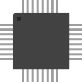

# Supermodel

Le Supermodel émule la plateforme d'arcade Sega Model 3.  
Il utilise **OpenGL 2.1** et **SDL**, et peut fonctionner sous Windows, Linux et Mac OS X

Il s'agit d'une sortie publique anticipée de Supermodel. Il s'agit d'un document très préliminaire, la version alpha du logiciel.  
Le développement a débuté en janvier 2011 et s'est concentré sur les aspects de rétro-ingénierie de la Modèle 3 encore inconnu.  
Par conséquent, de nombreuses caractéristiques importantes, telles que une interface utilisateur appropriée, ne sont pas encore mises en œuvre et la compatibilité des jeux est encore faible.

## ​Licence

Ce core est sous licence [**GPLV3**](https://www.supermodel3.com/About.html).

##  Compatibilité

| RPI0/RPI1 | RPI2 | RPI3 | RPI4 | RPI-400 | ODROID XU4 | ODROID GO | PC x86 | PC x86\_64 |
| :---: | :---: | :---: | :---: | :---: | :---: | :---: | :---: | :---: |
| ❌ | ❌ | ❌ | ❌ | ❌ | ❌ | ❌ | ✅ | ✅ |

## Fonctionnalités

| Fonctionnalité | Raccourci |
| :---: | :---: |
| **Pause** | `Hotkey + B` |
| **Save State** | `Hotkey + Y` |
| **Load Save State** | `Hotkey + X` |
| **Change Slot Saves** | `Hotkey + Dpad Up` |
| **Screenshot** | `Hotkey + L1` |

## BIOS


>**Aucun bios n'est requis.**
{.is-success}

## \*\*\*\***Roms**

**Model3** se base sur le romset de **Mame 0.220**.


>Vous devez obligatoirement passer votre romset MAME dans ClrMamePro pour avoir un romset Model3 fonctionnel.
{.is-danger}


>**Information:**
>
>Afin de trier vos roms arcade, les **fichiers dat** sont disponibles dans le dossier `/recalbox/share/bios/model3/`ou ci- dessous en téléchargement.
{.is-success}



### **Emplacement**

Placez les roms comme ceci :

> 📁recalbox
>
> > 📁share
> >
> > > 📁roms
> > >
> > > > 📁model3
> > > >
> > > > > 🗒**fichier.zip**

## Configuration avancée de l'émulateur <a id="configuration-avancee-de-lemulateur"></a>


>**Attention :**  
>Pour pouvoir conserver vos configurations personnalisées lors d'une mise à jour, nous vous conseillons d'utiliser notre fonctionnalité [Surcharges de configuration](/fr/usage-avance/surcharge-de-configuration).
{.is-danger}

### Accéder aux options

Vous pouvez configurer diverses options de deux façons différentes.

* Via le Menu RetroArch :

> 📁Menu RetroArch
>
> > 📁Options du core
> >
> > > 🧩Name\_option

* Via le fichier `retroarch-core-options.cfg`:

> 📁recalbox
>
> > 📁share
> >
> > > 📁system
> > >
> > > > 📁configs
> > > >
> > > > > 📁retroarch
> > > > >
> > > > > > 📁cores
> > > > > >
> > > > > > > 🧩**retroarch-core-options.cfg**

\*\*\*\*

### Le fichier de configuration de Supermodel  :

```text
#
#  ####                                                      ###           ###
# ##  ##                                                      ##            ##
# ###     ##  ##  ## ###   ####   ## ###  ##  ##   ####       ##   ####     ##
#  ###    ##  ##   ##  ## ##  ##   ### ## ####### ##  ##   #####  ##  ##    ##
#    ###  ##  ##   ##  ## ######   ##  ## ####### ##  ##  ##  ##  ######    ##
# ##  ##  ##  ##   #####  ##       ##     ## # ## ##  ##  ##  ##  ##        ##
#  ####    ### ##  ##      ####   ####    ##   ##  ####    ### ##  ####    ####
#                 ####                                                            
#
#                       A Sega Model 3 Arcade Emulator.
#                Copyright 2011 Bart Trzynadlowski, Nik Henson


# ----------------------------- CONTROLLERS -------------------------------- #
# The rate at which analog control values increase/decrease
# when controlled by a key.  Valid range is 1-100, with 1
# being the least sensitive (slowest response) on default [25]
sensitivity=25

# Specifies the saturation, the position at which the joystick
# is interpreted as being in its most extreme position,
# as a % of the total range of the axis, from 0-200.
# A value of 200 means that the range will be halved, on default [100].
saturation=100

# Specifies the dead zone as a percentage,
# 0-99, of the total range of the axis.
# Within the dead zone, the joystick is inactive on default [2].
deadzone=2

# ------------------------------- AUDIO ------------------------------------- #

# Master Volume in %
sound-volume=100
# Set Music volume in %
music-volume=100

# Swap left and right audio channels
flip-stereo=0
# Relative front/rear balance in %
balance=0

# Disable sound board emulation sound effects
no-sound=0
# Disable Digital Sound Board MPEG music
no-dsb=0

# Select your sound engine:
# New SCSP engine based on MAME [0]
# Legacy SCSP engine [1]
sound-engine=0

# ------------------------------- VIDEO ------------------------------------- #

# set your graphics resolution automaticly with [auto]
# or set on this format [1280,1024] or [none] if needed
resolution=auto

# set on default ratio with [0]
# Expand 3D field of view to screen width [1]
# ignoring aspect ratio with [2]
screen-ratio=0
# Disable 60 Hz frame rate lock
no-throttle=0

# New 3D engine on default [0] enable 
# Legacy 3D engine only if no image only sound set [1] to enable 
3d-engine=0
# Use 8 texture maps for decoding
multi-texture=0
# Enable proper quad rendering
quad-rendering=0

# Crosshairs configuration for gun games
crosshairs=1

# -------------------------------- CORE ------------------------------------- #

# Run graphics rendering in main thread
no-gpu-thread=1
# Disable [0], Enable [1] multi-threading.
no-threads=0

# The PowerPC frequency in MHz.
# The default is [50].
ppc-frequency=100

# Enable [1] or Disable [0] menu services [L3=test, R3=service]
service-button=1

# Log level information in Supermodel.log
# Default value : info
# add value : error
log-level=info
```

**Emplacement du fichier :** `/recalbox/share/system/configs/model3/ConfigModel3.ini`

### Options du core

## **Liens externes**

* **Forum Officiel :** [https://www.supermodel3.com/](https://www.supermodel3.com/)
* **Source Forge Officiel :** [https://sourceforge.net/projects/model3emu/](https://sourceforge.net/projects/model3emu/)

