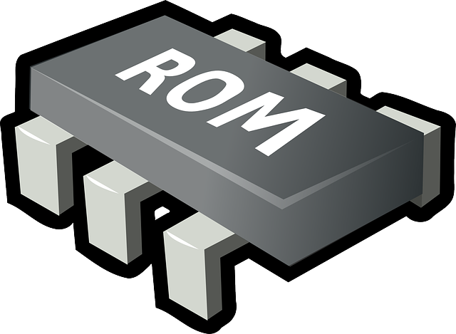

# Libretro PicoDrive

**Libretro PicoDrive** est un émulateur open-source Sega [**8**](/v/francais/emulateurs/consoles-de-salon/master-system)/[**16**](/v/francais/emulateurs/consoles-de-salon/megadrive) bit et ****[**32X**](/v/francais/emulateurs/consoles-de-salon/32x). Il a été réfléchi pour les appareils portable sur l'architecture [**ARM**](https://fr.wikipedia.org/wiki/Architecture_ARM).

##  Licence

Ce core est sous licence [**non-commerciale**](https://github.com/libretro/picodrive/blob/master/COPYING)**.**

##  Compatibilité

| RPI0/RPI1 | RPI2 | RPI3 | RPI4 | RPI-400 | ODROID XU4 | ODROID GO | PC x86 | PC x86\_64 |
| :---: | :---: | :---: | :---: | :---: | :---: | :---: | :---: | :---: |
| ✅ | ✅ | ✅ | ✅ | ✅ | ✅ | ✅ | ✅ | ✅ |

## Fonctionnalités

| Fonctionnalité | Supporté |
| :---: | :---: |
| Restart | ✔ |
| Saves | ✔ |
| States | ✔ |
| Rewind | ✔ |
| Netplay | ✔ |
| Core Options | ✔ |
| RetroAchievements | ✔ |
| RetroArch Cheats | ✔ |
| Controls | ✔ |
| Remapping | ✔ |
| Disk Control | ✔ |

## BIOS

>**Aucun bios n'est requis.**
{.is-success}

## \*\*\*\***Roms**

### **Extensions supportées**

Les roms doivent avoir les extensions suivantes :

* .32x
* .bin
* .smd
* .zip
* .7z

Ce système supporte les roms compressées au format .zip/.7z. Attention toutefois, il ne s'agit que d'une archive.

Les fichiers contenus dans les .zip/.7z doivent correspondre aux extensions citées précédemment.  
De plus, chaque fichier .zip/.7z ne doit contenir qu'une seule rom compressée.

### **Emplacement**

Placez les roms comme ceci : 

> 📁recalbox
>
> > 📁share
> >
> > > 📁roms
> > >
> > > > 📁**sega32x**
> > > >
> > > > > 🗒**fichier.zip**

>Les roms au format **No-Intro** sont vivement conseillées.
{.is-success}

>Pour plus d'information sur les roms, rendez-vous sur [ce tutoriel](/v/francais/tutoriels/jeux/generalite/les-roms-et-les-isos) !
{.is-info}

### **Compatibilité**

| Jeux 32x | **Problèmes connus** |
| :--- | :--- |
| Brutal Unleashed – Above the Claw | Softlock après le premier combat. |
| FIFA Soccer ’96 | Texte du menu principal avec des glitches. |
| Knuckles’ Chaotix | Graphismes avec glitches sur l'écran de sélection du joueur. |
| NBA Jam Tournament Edition | Problèmes de framerate. |
| NFL Quarterback Club | Certains graphismes du menu sont manquants. |
| Virtua Racing Deluxe | Ligne clignotante pendant l'affichage du logo SEGA. |
| World Series Baseball Starring Deion Sanders | Plante quand un match commence. |
| WWF Raw | Certains graphismes sont manquants. |

## Configuration avancée de l'émulateur

>**Attention :**  
>Pour pouvoir conserver vos configurations personnalisées lors d'une mise à jour, nous vous conseillons d'utiliser notre fonctionnalité [Surcharges de configuration](/v/francais/usage-avance/surcharge-de-configuration).
{.is-danger}

### Accéder aux options

Vous pouvez configurer diverses options de deux façons différentes.

* Via le Menu RetroArch :

> 📁Menu RetroArch
>
> > 📁Options du core
> >
> > > 🧩Name\_option

* Via le fichier `retroarch-core-options.cfg`:

> 📁recalbox
>
> > 📁share
> >
> > > 📁system
> > >
> > > > 📁configs
> > > >
> > > > > 📁retroarch
> > > > >
> > > > > > 📁cores
> > > > > >
> > > > > > > 🧩**retroarch-core-options.cfg**

### Options du core

## **Liens externes**

* **Github utilisé :** [https://github.com/libretro/picodrive/](https://github.com/libretro/picodrive)
* **Doc Libretro :** [https://docs.libretro.com/library/picodrive/](https://docs.libretro.com/library/picodrive/)

