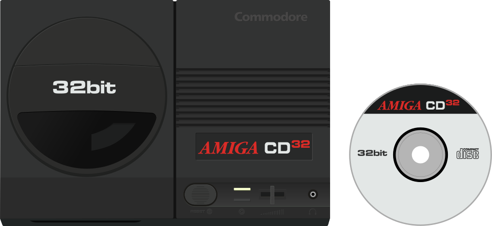

# Amiga CD32

## Fiche technique

* **Fabriquant :** Commodore International
* **Année de sortie :** 1993
* **Système d'exploitation :** AmigaOS 3.1
* **Processeur :** Motorola 68EC020 @ 14.32 MHz \(NTSC\), 14.18 MHz \(PAL\)
* **RAM :** 2 MB
* **ROM :** 1 MB Kickstart avec le firmware CD32, 1 KB EEPROM pour les sauvegardes des jeux
* **Processeur graphique :** Advanced Graphics Architecture
* **Puce sonore :** 4 canaux 8-bit PCM
* **Résolution :** 320x200 à 1280x400i \(NTSC\), 320x256 à 1280x512i \(PAL\)

## Présentation

L’**Amiga CD32** est une console de jeux vidéo de [cinquième génération](https://fr.wikipedia.org/wiki/Histoire_des_consoles_de_jeux_vid%C3%A9o_de_cinqui%C3%A8me_g%C3%A9n%C3%A9ration) développée par [Commodore](https://fr.wikipedia.org/wiki/Commodore_International) et commercialisée en septembre [1993](https://fr.wikipedia.org/wiki/1993). La CD32 est une console 32-bit dont l'architecture est basée sur l'ordinateur [**Amiga 1200**](/v/francais/emulateurs/ordinosaures/amiga-1200).

L'**Amiga CD32** est la première 32-bit à voir le jour en Occident \(la [FM Towns Marty](https://fr.wikipedia.org/wiki/FM_Towns_Marty) l'a précédée au Japon\). Comme la [**3DO**](/v/francais/emulateurs/consoles-de-salon/3do) ou l'[**Atari Jaguar**](/v/francais/emulateurs/consoles-de-salon/atari-jaguar), commercialisées dans la même période, la CD32 n'est pas parvenue à percer sur le marché malgré le soutien des fans de la gamme [**Amiga**](https://fr.wikipedia.org/wiki/Amiga). Ses limitations techniques, son mode d'affichage en bitplan la limitant grandement dans l'affichage des jeux en 3D texturée comme [**Doom**](/v/francais/emulateurs/ports/doom) en vogue à l'époque, le manque d'implication des développeurs et les difficultés financières de Commodore sont autant d'explications avancées de son échec.

## Émulateurs





