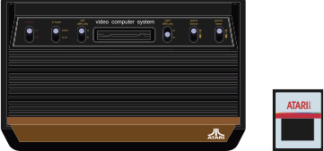

# Atari 2600

## 

## Fiche technique

* **Fabriquant :** Atari Corporation
* **Année de sortie :** 1977
* **Quantités vendues :** 30 million
* **Meilleure jeu vendu :** Pac-Man
* **Processeur :** 8-bit MOS 6507 @ 1.19 MHz
* **RAM :** 128 bytes
* **Processeur Audio / Vidéo :** TIA
* **Résolution :** 160 x 192 pixels, 4 couleurs par ligne \(palette de 128 couleurs\)
* **Puce sonore :** 2 canaux de 1-bit mono avec contrôle du volume 4-bit
* **Taille des cartouches :** 2kB - 32kB

## Présentation

En 1976, Fairchild Camera et Instrument sortirent le [**Channel F**](/fr/emulateurs/consoles-de-salon/channelf) system, première console de salon munie d'un support cartouche. Un an plus tard, suivit la Studio II \(créée par RCA\), 2ème console de salon de l'histoire... Et enfin, au mois d'Octobre 1977, Atari sortit l'**Atari VCS** \(Video Computer System\) avec 9 jeux disponibles.

La firme Atari accepte, en 1982, qu'une dizaine de développeurs tiers sortent des jeux sur la console. Financièrement, Atari en sortit avec des bénéfices mais ludiquement, ce fut un désastre... Bien qu'il y eût toujours des titres de qualité, un grand nombre de daubes sortirent sur l'**Atari VCS**...

En 1983, de plus en plus de compagnies produisent des jeux et accessoires; et ce qui devait arriver arriva : Il y eût trop de produits pour la demande et de nombreux développeurs fermèrent leurs portes. Ce fût un [**crash pour le monde des jeux vidéo**](https://fr.wikipedia.org/wiki/Krach_du_jeu_vid%C3%A9o_de_1983).

En 1984, le prix de l'**Atari 2600** chuta et ne valait même plus le tiers du prix initial. Les années 1984 et 1985 furent vraiment pauvre en ce qui concerne les jeux vidéo et seulement quelques jeux sortirent, dont Cosmic Commuter et Ghostbusters. Malgré tout, la console se vendait encore bien car elle était devenue très bon marché et possédait une énorme ludothèque.

En 1986 sortit la [**NES**](/fr/emulateurs/consoles-de-salon/nintendo-entertainement-system) de chez Nintendo, qui eût un énorme succès. Atari décida alors de sortir l'**Atari 2600** **Jr**., une Atari 2600 re-designée.

En 1987 et 1988, d'excellents jeux sortirent comme par exemple Pac-Man Jr. L'**Atari VCS** fut renommée quelques temps plus tard **Atari 2600** et domina le marché des consoles pendant plusieurs années, jusqu'au début des années 80.

## Émulateurs



