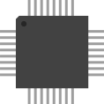

# Libretro FreeChaF

##  Licence

Ce core est sous licence [**GPLv3**](https://github.com/libretro/FreeChaF/blob/master/LICENSE).

##  Compatibilité

| RPI0/RPI1 | RPI2 | RPI3 | RPI4 | RPI-400 | ODROID XU4 | ODROID GO | PC x86 | PC X86\_64 |
| :---: | :---: | :---: | :---: | :---: | :---: | :---: | :---: | :---: |
| ✅ | ✅ | ✅ | ✅ | ✅ | ✅ | ✅ | ✅ | ✅ |

##  Fonctionnalités

| **Fonctionnalité** | Supporté |
| :---: | :---: |
|  |  |

##  BIOS

### Liste des bios obligatoires

| Nom de fichier | Description | MD5 | Fourni |
| :---: | :---: | :---: | :---: |
| sl31253.bin | ChannelF BIOS \(PSU 1\) | ac9804d4c0e9d07e33472e3726ed15c3 | ❌ |
| sl31254.bin | ChannelF BIOS \(PSU 2\) | da98f4bb3242ab80d76629021bb27585 | ❌ |
| sl90025.bin | ChannelF II BIOS \(PSU 1\) | 95d339631d867c8f1d15a5f2ec26069d | ⚠ |

⚠ Fourni mais n'a pas la bonne signature MD5.

### **Emplacement**

Placez les bios comme ceci :

> 📁recalbox
>
> > 📁share
> >
> > > 📁bios
> > >
> > > > 🗒**sl31253.bin**
> > > >
> > > > \*\*\*\*🗒 **sl31254.bin**
> > > >
> > > > \*\*\*\*🗒 **sl90025.bin**

##  Roms

### **Extensions supportées**

Les roms doivent avoir les extensions suivantes :

* .bin
* .rom
* .chf
* .zip
* .7z

Ce système supporte les roms compressées au format .zip/.7z. Attention toutefois, il ne s'agit que d'une archive.

Les fichiers contenus dans les .zip/.7z doivent correspondre aux extensions citées précédemment.  
De plus, chaque fichier .zip/.7z ne doit contenir qu'une seule rom compressée.

### **Emplacement**

Placez les roms comme ceci : 

> 📁recalbox
>
> > 📁share
> >
> > > 📁roms
> > >
> > > > 📁channelf
> > > >
> > > > > 🗒**fichier.zip**

>Les roms au format **No-Intro** sont vivement conseillées.
{.is-success}

>Pour plus d'information sur les roms, rendez-vous sur [ce tutoriel](/v/francais/tutoriels/jeux/generalite/les-roms-et-les-isos) !
{.is-info}

##  Configuration avancée de l'émulateur

>**Attention :**  
>Pour pouvoir conserver vos configurations personnalisées lors d'une mise à jour, nous vous conseillons d'utiliser notre fonctionnalité [Surcharges de configuration](/v/francais/usage-avance/surcharge-de-configuration).
{.is-danger}

### Accéder aux options

Vous pouvez configurer diverses options de deux façons différentes.

* Via le Menu RetroArch :

> 📁Menu RetroArch
>
> > 📁Options du core
> >
> > > 🧩Name\_option

* Via le fichier `retroarch-core-options.cfg`:

> 📁recalbox
>
> > 📁share
> >
> > > 📁system
> > >
> > > > 📁configs
> > > >
> > > > > 📁retroarch
> > > > >
> > > > > > 📁cores
> > > > > >
> > > > > > > 🧩**retroarch-core-options.cfg**

### Options du core

##  Liens externes

* **Github utilisé** : [https://github.com/libretro/FreeChaF/](https://github.com/libretro/FreeChaF/)
* **Doc Libretro** : 

