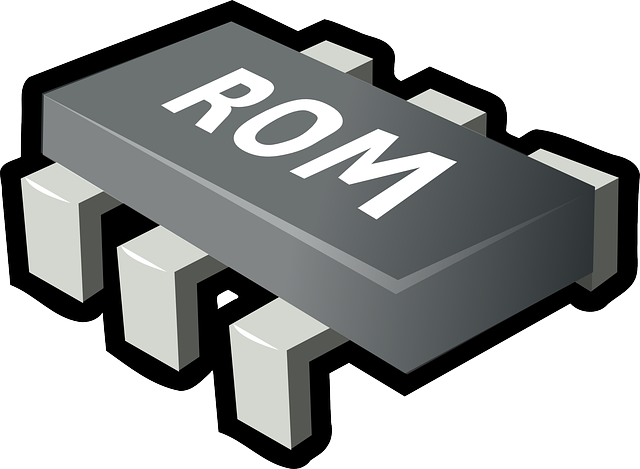

# Mupen64Plus RICE

##  Licence

Ce core est sous licence **MIT**.

##  Compatibilité

| RPI0/RPI1 | RPI2 | RPI3 | RPI4 | RPI-400 | ODROID XU4 | ODROID GO | PC x86 | PC x86\_64 |
| :---: | :---: | :---: | :---: | :---: | :---: | :---: | :---: | :---: |
| ❌ | ✅\* | ✅\* | ❌ | ❌ | ❌ | ❌ | ❌ | ✅ |

\* Basses performances mais jouable

##  Fonctionnalités

##  BIOS

>**Aucun bios n'est requis.**
{.is-success}

##  Roms

### **Extensions supportées**

Les roms doivent avoir les extensions suivantes :

* .n64
* .v64
* .z64
* .bin
* .u1
* .zip
* .7z

Ce système supporte les roms compressées au format .zip/.7z. Attention toutefois, il ne s'agit que d'une archive.

Les fichiers contenus dans les .zip/.7z doivent correspondre aux extensions citées précédemment.  
De plus, chaque fichier .zip/.7z ne doit contenir qu'une seule rom compressée.

### Emplacement

Placez les roms comme ceci :

> 📁 recalbox
>
> > 📁 share
> >
> > > 📁 roms
> > >
> > > > 📁 n64
> > > >
> > > > > 🗒 **fichier.zip**

>Les roms au format **No-Intro** sont vivement conseillées.
{.is-success}

>Pour plus d'information sur les roms, rendez-vous sur [ce tutoriel](/v/francais/tutoriels/jeux/generalite/les-roms-et-les-isos) !
{.is-info}

##  Configuration avancée de l'émulateur

##  Liens externes

* **Github utilisé** : [https://github.com/mupen64plus/mupen64plus-video-rice/](https://github.com/mupen64plus/mupen64plus-video-rice/)
* **Doc** : [http://www.mupen64plus.org/](http://www.mupen64plus.org/)

