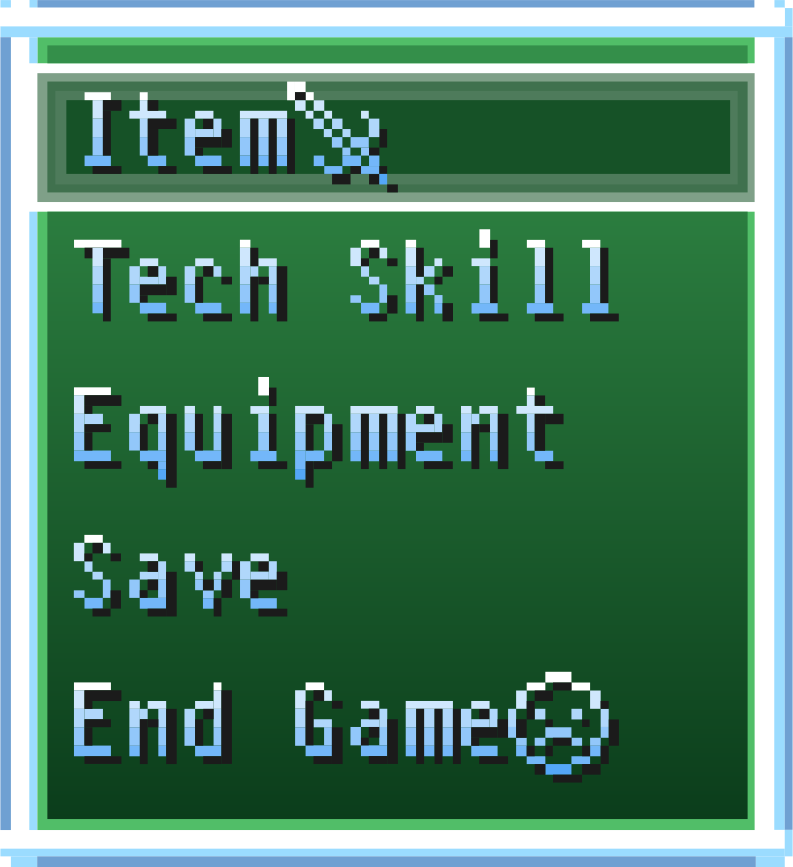

# EasyRPG

## Fiche technique

* **Fabricant :** -
* **Année de sortie :** -

## Présentation

EasyRPG est un projet communautaire qui vise à créer un outil de création de jeu de rôle \(RPG\) gratuit \(comme en liberté\) multiplateforme et multilingue, inspiré d'un produit commercial appelé RPG Maker.

Le projet est composé de plusieurs parties :

* [EasyRPG Player](https://easyrpg.org/player/) EasyRPG Player est un programme qui permet de jouer à des jeux créés avec RPG Maker 2000 et 2003 Il vise à être un interprète RPG Maker 2000/2003 multiplateforme gratuit \(comme en liberté\). L'objectif principal est de jouer à tous les jeux créés avec eux comme le fait l'interprète de jeu original \(RPG\_RT\).
*  [RTP Replacement](https://easyrpg.org/rtp-replacement/)
*  [Tools](https://easyrpg.org/tools/)
*  [EasyRPG Editor](https://easyrpg.org/editor/)

Leurs principaux objectifs :

* Libre comme en liberté : chaque composant du projet sera publié sous une licence libre.
* Multiplateforme : ils veulent qu'EasyRPG atteigne autant de plates-formes que possible.
* Multi-langue : plus il y a de langues prises en charge, mieux c'est.

**Contribuez à ce projet**

Il s'agit d'un projet gratuit et open source \(FLOSS\). Tout le monde peut aider, des programmeurs ou artistes aux testeurs et traducteurs.

## Émulateurs



