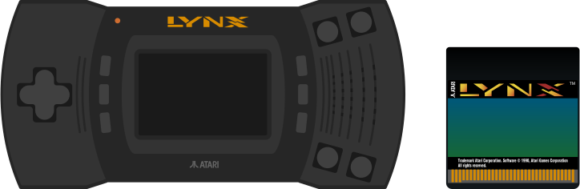

# Atari Lynx

## Fiche technique

* **Fabricant** : Epyx / Atari
* **Année de sortie** : 1989
* **Quantités vendues** : 1 million
* **Processeur** : 8-bit avec un espace d'adressage 16-bit
* **Co-processeurs** : Mikey et Suzy 2 x 16-bit
* **RAM** : 64K 120 ns DRAM
* **ROM** : 512 bytes
* **Résolution** : 160 x 102 pixels
* **Son** :  4 canaux, 8-bit DAC

## Présentation

L'**Atari Lynx** fut la seule console portable d'Atari et la première portable avec un écran LCD couleur. Elle est sortie en 1989.

La machine fut développée par Epyx sous le nom « Handy2 » \(c'est aujourd'hui le nom de l'émulateur le plus avancé sur PC de cette console\). Durant un stade très avancé du développement, la société chercha des investisseurs pour son projet, et porta d'abord son choix sur Nintendo qui refusa d'investir dans le projet, ce qui conduisit Epyx à se tourner vers Atari qui racheta les droits en 1988.

La compagnie modifia le haut parleur interne et supprima le stick qui se trouvait alors sur le pad. Atari commercialisa la console deux ans plus tard. On pouvait inverser l'écran pour jouer en tant que gaucher et jouer jusqu'à 8 en réseau. Les capacités techniques étaient largement plus performantes que celles de la Game Boy \(couleur et 3D obligent\). La Lynx, elle, était plus imposante, trop gourmande en piles et manquait de titres porteurs.

En 1991, Atari sortit une seconde version de sa console sous une nouvelle forme, avec des cartouches relookées. La nouvelle console \(nommée par Atari « Lynx II »\) possédait des grips de prise en main, un écran de meilleure qualité avec une option d'économie d'énergie qui permettait de mettre la console en mode veille.

## Émulateurs





