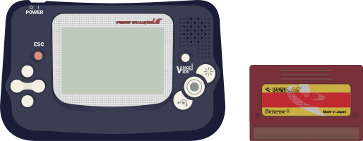

# Pocket Challenge V2

## Fiche technique

* **Fabricant** : Benesse Corporation
* **Année de sortie** : 2000
* **Processeur** : 16Bits NEC V20
* **RAM** : 512k video
* **Résolution** : 224 x 144 pixels
* **Son** : 4 PCM canaux, 32 samples 4Bit pour chaque canal

## Présentation

La Pocket Challenge v2 est une console portable par Benesse Corporation, une société japonaise focalisé sur l'éducation. La console a été crée comme un appareil éducatif. Benesse corporation, proopriétaire de Berlitz Language Schools, a sorti quelques jeux sur l'apprentissage des langues. La Pocket Challenge v2 est entièrement compatible avec la Bandai WonderSwan, crée par Gunpei Yokoi, le même génie qui a crée la Nintendo Game & Watch et la Nintendo GameBoy. Comme il est possible de jouer de renommée comme Final Fantasy, Gunpay, Klonoa, Mobile Suit Gundam ou Pocket Fighters, la Pocket Challenge était une des consoles éducatives les plus fun.

## Émulateurs



