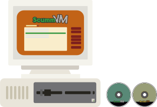

# ScummVM/ResidualVM

## Fiche technique

* 
## Présentation

**ScummVM** est une machine virtuelle qui permet de jouer aux jeux qui utilisent le système SCUMM \(comme les jeux d'aventure de LucasArts ou d'Humongous\) sur des plates-formes autres que celles originellement supportées par le [jeu](https://fr.wikipedia.org/wiki/Jeu_vid%C3%A9o) ; de plus, le logiciel supporte les jeux non-SCUMM suivants : Simon the Sorcerer I et II, Beneath a Steel Sky, The Legend of Kyrandia, Flight of the Amazon Queen et Broken Sword 1 et 2. L'un des buts du programme étant de permettre l'accessibilité à divers utilisateurs utilisant divers systèmes de jouer à ces classiques, diverses versions de ScummVM prenant en charge des systèmes d'exploitation variés sont disponibles : Microsoft Windows, Atari, WinCE, Pocket PC, Mac OS X, Linux, Android, Palm OS, HP webOS, Open webOS, AmigaOS, BeOS, Solaris, Dreamcast, MorphOS, Irix, PSP, PS2, GP32, Wii, DS et plus. ScummVM est un logiciel libre, selon les termes de la licence GNU GPL.

## Émulateurs





