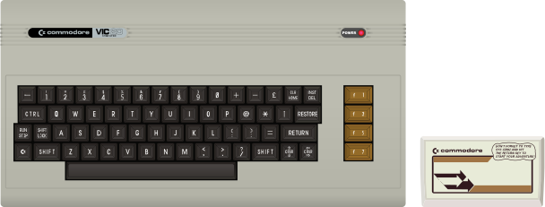

# VIC-20

## Fiche technique

* **Fabricant** : Commodore
* **Année de sortie** : 1980
* **Système d'exploitation** : Commodore KERNAL / Commodore BASIC 2.0
* **Processeur** : MOS Technology 6502 @ 1.02 MHz \(NTSC\) / 1.10 MHz \(PAL\)
* **RAM** : 5 KB \(allant jusqu'à 32 KB\)
* **ROM** : 20KB
* **Processeur graphique** : MOS Technology VIC-I 6561
* **Puce sonore** : 3 x square, 1 x nose, mono
* **Résolution** : 128x128 \(16 couleurs\)

## Présentation

Le **VIC-20** est un ordinateur personnel 8 bits qui était construit par Commodore International avec 5 ko de RAM \(dont 3,5 ko pour les applications BASIC\) et une unité centrale basée sur un processeur MOS 6502. Il ressemblait à ses successeurs le C64 et le C16. Le VIC-20 apparut en juin 1980, 2 ans et 9 mois après la sortie du premier ordinateur personnel de Commodore, le PET.

Le VIC-20 devait se positionner comme un ordinateur grand public, contrairement au PET. On rapporte que la puce vidéo du VIC-20, nommée VIC créé par MOS Technology, avait été à l'origine conçue pour des terminaux graphiques d'entrée de gamme et des consoles de jeux, mais Commodore ne parvenait pas à la vendre correctement. Au même moment, Commodore possédait un surplus de mémoires SRAM de 4\*1 ko. En avril 1980, Jack Tramiel, le président de Commodore, demanda que l'on fabrique un ordinateur qui se vendrait en dessous des 300 $. Le surplus donna ainsi naissance au VIC-20. Alors que le PET n'était vendu qu'auprès de revendeurs agréés, le VIC-20 fut dès le départ vendu au détail, particulièrement dans les boutiques discount et les magasins de jouets où il faisait directement concurrence aux consoles de jeux. Commodore mit en place des publicités où l'acteur William Shatner de Star Trek demandait : « Pourquoi se contenter de n'acheter qu'un simple jeu vidéo ? »

Bien que les magazines eussent reproché au VIC-20 d'être sous-dimensionné, la stratégie fonctionna : il devint le premier ordinateur à dépasser la barre du million d'unités vendues et devint l'ordinateur le plus vendu au monde en 1982. À son apogée, 9 000 unités étaient produites chaque jour, et ce sont ainsi 2 500 000 unités qui ont été vendues jusqu'à l'arrêt de sa production en janvier 1985, lorsque Commodore repositionna le C64 comme son ordinateur d'entrée de gamme afin de préparer la sortie prochaine du Commodore 128 et de l'Amiga \(celui-ci introduisant Commodore dans le monde du 16/32 bits\).

En raison de sa faible mémoire et de son affichage à basse résolution, comparé à d'autres ordinateurs de l'époque, le VIC-20 servit essentiellement à des fins éducatives ou ludiques. Cependant, des programmes utilitaires tels que gestion du budget familial, tableur ou terminal de communication furent également développés pour cette machine. Sa facilité de prise en main par le grand public permit à nombre de futurs développeurs de débuter sur le VIC-20 en s'initiant au langage BASIC, voire à l'Assembleur \(ou langage machine\). Plusieurs revues, telles que Compute !4, publièrent des [codes source](https://fr.wikipedia.org/wiki/Code_source) de programmes pour le VIC-20, l'un d'eux ayant été proposé par Commodore lui-même. Ainsi, de nombreux utilisateurs apprirent à programmer en tapant, étudiant, exécutant et modifiant ces programmes. C'est le cas de Linus Torvalds, par exemple.

La facilité de programmation et la disponibilité d'un modem à bas prix permirent d'offrir au VIC-20 une bibliothèque fournie de logiciels du domaine public ou en freeware, d'une taille cependant bien inférieure à la bibliothèque du C64. Les logiciels étaient diffusés sur des services en ligne comme CompuServe, des BBS \(Bulletin Board System\) et entre groupements d'utilisateurs.

En ce qui concerne le catalogue commercial, on estime que 300 titres étaient disponibles sur cartouche électronique, et plus de 500 sur cassette. En comparaison, l'Atari 2600, la plus populaire des consoles de jeux à cette époque, proposait environ 900 titres.

## Émulateurs



