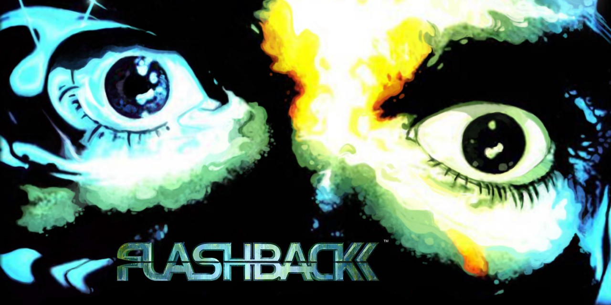
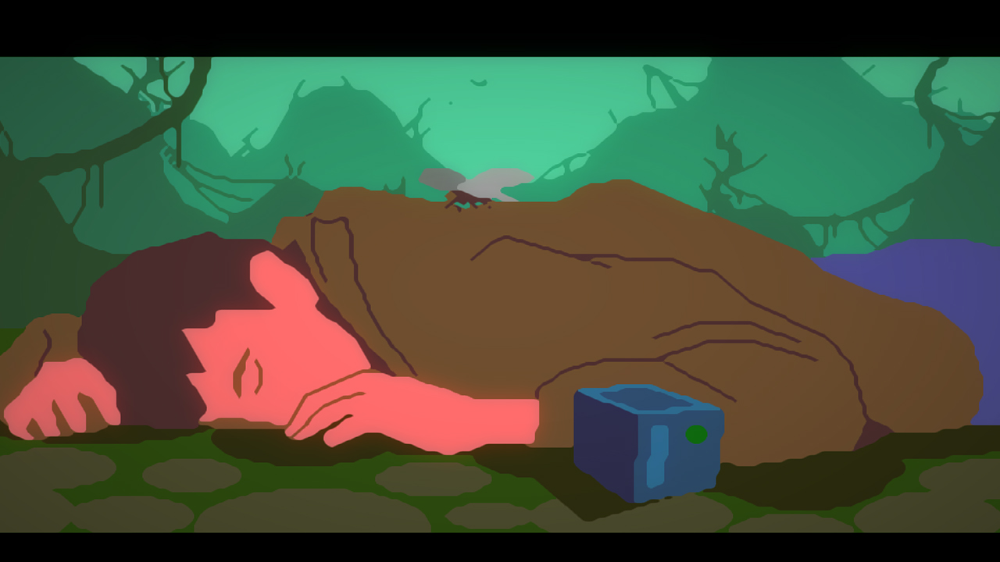

# Flashback

## Fiche technique

* **Crée par :** Delphine Software International
* **Année de sortie :** 1992
* **Genre :** Platformer
* **Plate-forme\(s\):** Amiga, Acorn Archimedes, Mega Drive/Genesis, MS-DOS, NEC PC-9801, Super NES, Sega CD, FM Towns, 3DO, CD-i, Atari Jaguar, Mac OS, iPhone OS, Symbian, Maemo, Dreamcast, Nintendo Switch, PlayStation 4.
* **Designer :** Paul Cuisset
* **Compositeurs :** Jean Baudlot, Fabrice Visserot, Raphaël Gesqua \(version Amiga\)
* **PEGI** : 12

## Synopsis

2142. Éminent scientifique, Conrad B. Hart, frappé d'amnésie, se trouve au cœur de la jungle lorsqu'il reprend connaissance. Non loin de lui se trouve un curieux boîtier générant une image holographique le représentant. Cette dernière lui demande de se rendre à New Washington, où l'attend un certain Ian. Faisant route vers la ville, Conrad ignore que des extra-terrestres sont infiltrés parmi la population et qu'il devra déjouer un incroyable complot interplanétaire tout en tentant de retrouver des holocubes contenant des fragments de sa mémoire...

Un scénario qui n'est pas sans rappeler la nouvelle de [Philip K. Dick](https://fr.wikipedia.org/wiki/Philip_K._Dick) [Souvenirs à vendre](https://fr.wikipedia.org/wiki/Souvenirs_%C3%A0_vendre_%28nouvelle%29) \(We Can Remember it for You Wholesale\) publiée en 1966 et adaptée au cinéma en 1990 par [Paul Verhoeven](https://fr.wikipedia.org/wiki/Paul_Verhoeven) sous le titre [Total Recall](https://fr.wikipedia.org/wiki/Total_Recall), soit deux ans seulement avant la sortie de Flashback.

## Émulateurs



