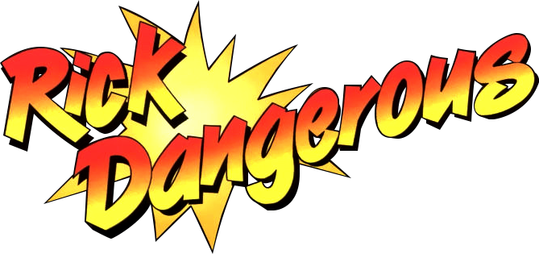

# Rick Dangerous

## Fiche technique

* **Crée par :** Core Design
* **Année de sortie :** 1989
* **Genre :** Plates-formes, Die and retry
* **Système d'exploitation :** Amiga 500, Amstrad CPC, Atari ST, Commodore 64, DOS et ZX Spectrum.
* **Programmation, conception :** [Simon Phipps](https://fr.wikipedia.org/w/index.php?title=Simon_Phipps&action=edit&redlink=1)
* **Graphisme :** [Simon Phipps](https://fr.wikipedia.org/w/index.php?title=Simon_Phipps&action=edit&redlink=1), [Terry Lloyd](https://fr.wikipedia.org/w/index.php?title=Terry_Lloyd_%28jeu_vid%C3%A9o%29&action=edit&redlink=1)
* **Musique :** Dave Pridmore
* **Design des niveaux :** Rob Toone, Bob Churchill
* **Programmation Amstrad et Spectrum :** Dave Pridmore
* **Programmation C64 :** Stu Gregg
* **Éditeur** : Rainbird Software
* **PEGI** : 3

## Présentation

**Rick Dangerous** est un jeu vidéo développé par Core Design et édité par Rainbird Software en 1989. Premier jeu original et premier succès de Core Design, Rick Dangerous est sorti sur Amiga 500, Amstrad CPC, Atari ST, Commodore 64, DOS et ZX Spectrum. Le jeu a acquis un statut culte et de nombreuses versions amateurs — portages, clones et remakes — ont vu le jour par la suite.

Bien avant Lara Croft, dans les années 1980 et au début des années 1990, Rick Dangerous était l'Indiana Jones des jeux vidéo, fuyant les rochers roulants, évitant les pièges, de l'Amérique du Sud à une base de missiles futuriste en passant par l'Égypte et le château de Schwarzendumpf.  
C'est un jeu de plates-formes au graphisme « cartoon » dans lequel le joueur incarne Rick Dangerous, une sorte d'Indiana Jones à la recherche de la tribu perdue des Goolus en Amazonie. Mais son avion s'écrase, et c'est là que le jeu commence. L'action se passe en 1945.

## Émulateurs



