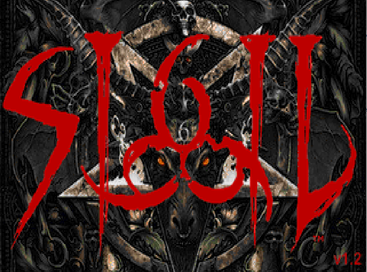

# Sigil

## Fiche technique

* Crée par :
* Année de sortie : 2019
* Moteur : id Tech 1 de Doom \(1993\)
* Développeur : John Romero
* Designer : John Romero
* Éditeur : Romero Games
* Musique : James Paddock, Buckethead

## Présentation

**Sigil** \(stylisé comme **SIGIL**\) est le cinquième épisode non-officiel du jeu vidéo de 1993, Doom. Édité par Romero Games le 31 mai 2019, le Megawad a été crée par un des auteurs de Doom, John Romero, indépendamment du propriétaire actuelle du jeu principal, Bethesda Softworks. Il contient neuf missions, cachun ayant une version match à mort et une nouvelle bande-son crée par James Paddock et Buckethead.

## Émulateurs



