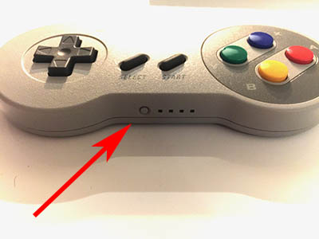
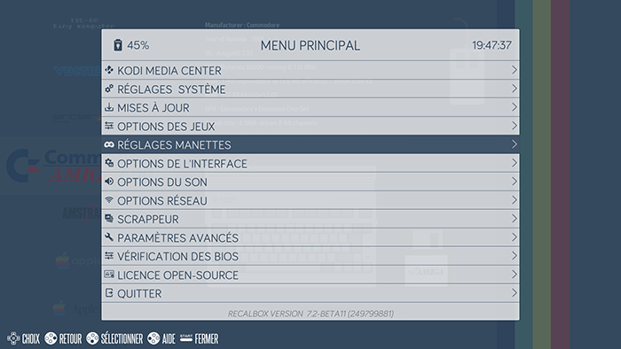
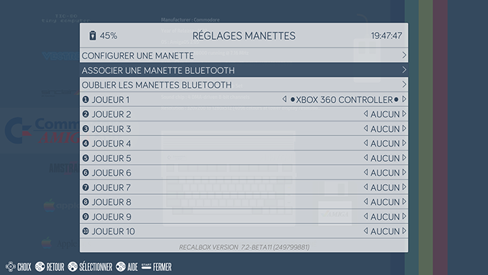
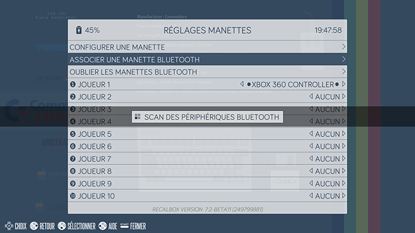
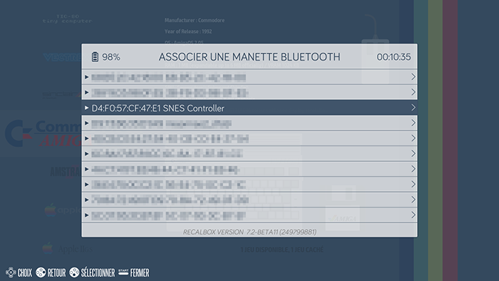
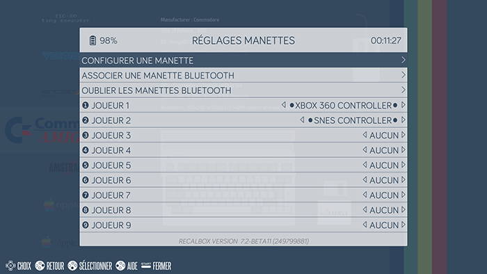

# Utilisation de la manette SNES

## Synchronisation

Sur chaque manette, il y a un petit bouton qui permet de l'allumer et de l'éteindre mais ce bouton permet aussi de faire une synchronisation avec votre boitier.

Dans Recalbox, dans vos listes de systèmes disponibles, appuyez sur **Start** de votre manette habituelle et allez dans **RÉGLAGES MANETTES**.

Dans ce menu, faites **ASSOCIER UNE MANETTE BLUETOOTH**.

Une fois la recherche de périphériques Bluetooth lancé, appuyez sur le bouton de synchronisation de la manette à associer. Celle-ci doit commencer à avoir les 4 lumières à côté en train de faire une sorte d'aller-retours de gauche à droite et inversement.

Une fois que la recherche de périphériques Bluetooth est terminée, vous devriez voir votre manette dans la liste.

Sélectionnez la manette et validez. Votre manette doit maintenant être reconnue et toujours avoir les 4 lumières faire des allers-retours.‌

Une fois l'association terminée, la manette apparaîtra dans la liste des manettes.

À vous les joies de jouer avec votre manette SNES !

## Paramétrage de la manette SNES

Une fois associé, la manette aura une configuration automatique détectée avec la touche **HOTKEY** sur **SELECT**.

