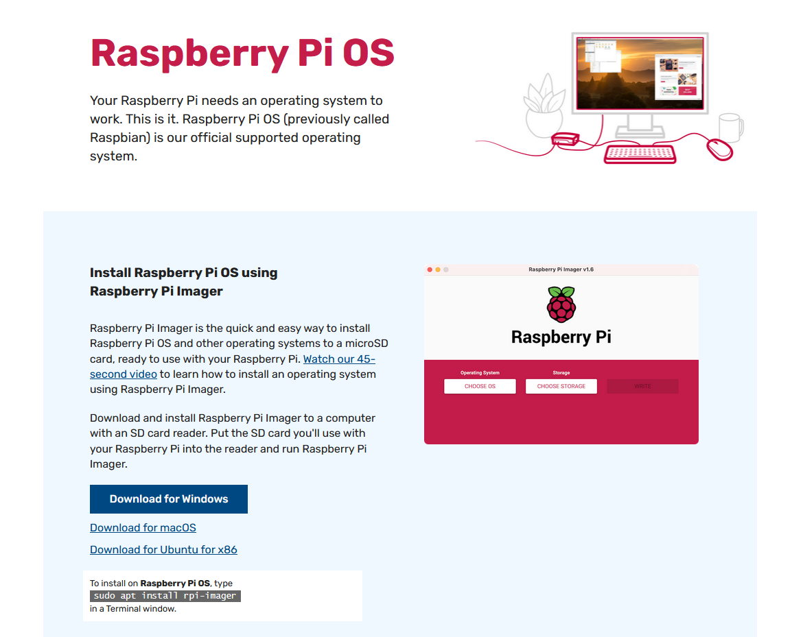
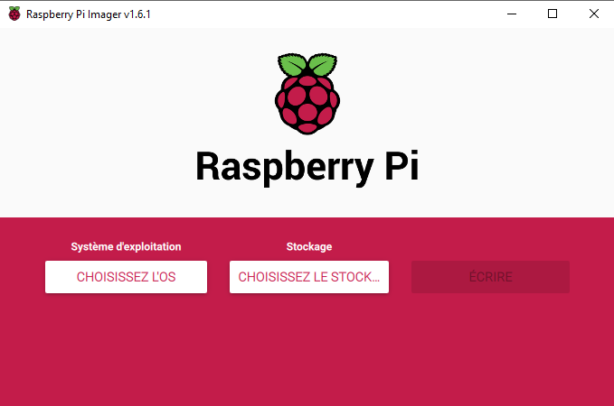
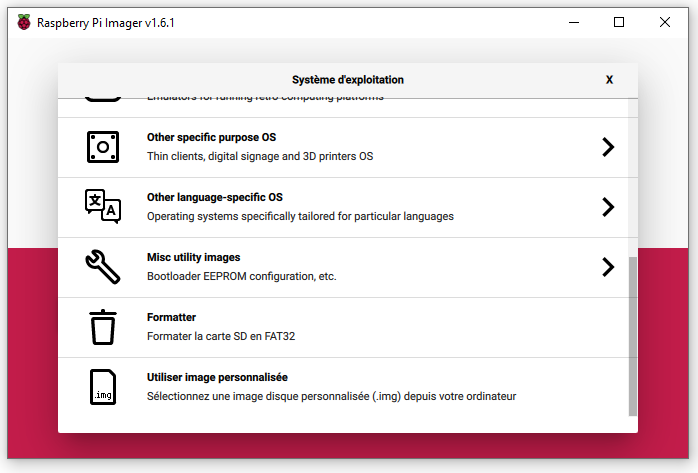
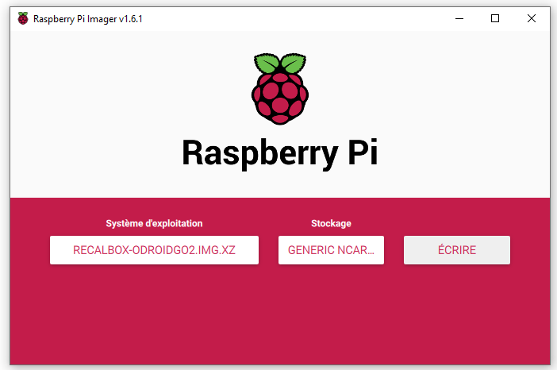
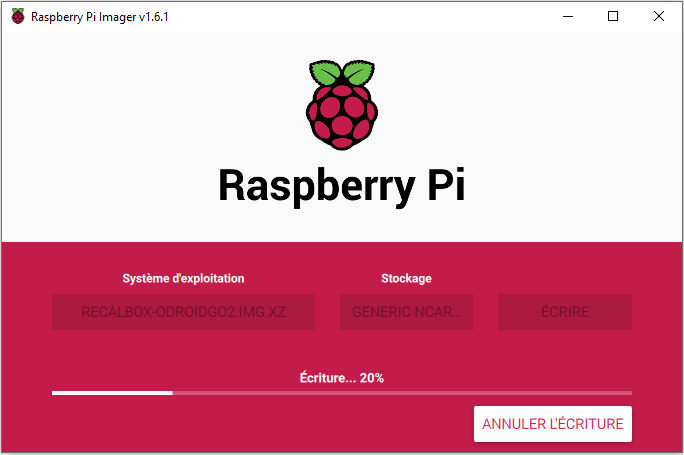
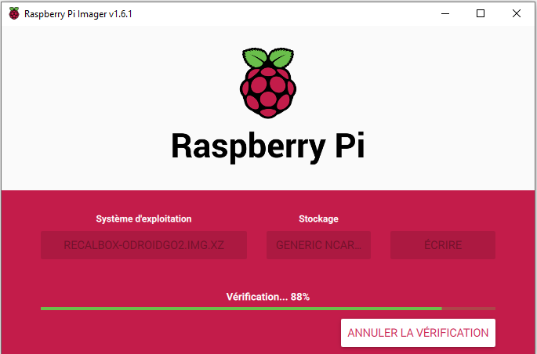
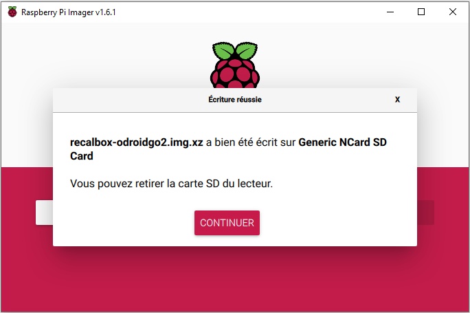

# Raspberry Pi Imager \(Recommandé\)

[Raspberry Pi Imager](https://www.raspberrypi.org/software/) \(très simple d'utilisation\), vous permet de flasher un fichier image sur le support désiré, une carte microSD par exemple. L'opération de flash d'une image est rapide et facile.

* Cliquez sur [Raspberry Pi Imager](https://www.raspberrypi.org/software/) pour vous rendre sur le lien de téléchargement puis installez-le sur votre ordinateur :

* Une fois installé, l'utilitaire se présente de cette façon :

* Cliquez sur "Choisissez l'OS", sélectionnez le fichier à flasher, puis cliquez sur "Choisissez le stockage" pour lancer la procédure.

>**Attention !** Il est très vivement recommandé de ne brancher _**que le**_ _**média de stockage que vous souhaitez flasher**_ afin d'éviter d'effacer vos données par erreur.
{.is-danger}

* Vous pourrez alors cliquer sur "Écrire". Raspberry Pi Imager se charge de tout, formatage, préparation des partitions, copie des fichiers, etc…

* Le programme indique le travail en cours.

* Il vérifie ensuite l’image.

* Et enfin signale le déroulement de l’opération.

Comme indiqué, vous pouvez éjecter le support de stockage, il ne vous reste plus qu'à insérer la microSD dans votre console et à jouer !

