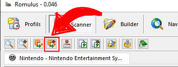

# Romulus pour les Consoles

## Avant de commencer

Pour trier les roms, Romulus a besoin d'un fichier .dat. Ce fichier va agir comme un catalogue répertoriant la liste et la description de chaque fichier rom afin de déterminer si, oui ou non, votre fichier correspond au fichier attendu par le romset.

Les fichiers Dat les plus adaptés aux consoles sont ceux de la team **NO-INTRO**. Il existe beaucoup d'autres sources pour ces fichiers mais elles ne seront pas abordés ici.

Rendez-vous sur le site [DAT-o-MATIC](https://datomatic.no-intro.org/?page=download) pour télécharger les fichiers .dat No-Intro.

### DAT-o-MATIC

Voici un exemple pour télécharger un fichier .dat No-Intro. Le site Dat-O-Matic évoluant régulièrement, il est possible que la méthode présentée ne soit plus tout à fait exhaustive.

#### 1. Ecran d'accueil

* A : Liste de tous les systèmes ayant un fichier .dat disponible

#### 2. Télécharger un fichier .dat

* **A** : Choix du système
* **B** : Cliquer sur **Prepare** pour afficher l'écran suivant

* **A** : Lancer le téléchargement

### Fichier Header

Pour pouvoir fonctionner avec Romulus, certains systèmes auront besoin d'un fichier additionnel nommé **Header** \(par exemple, c'est le cas pour la Nintendo NES\). Pensez à le télécharger en même temps que le fichier .dat.

### Pour aller plus loin

Comme vous pouvez le voir sur les captures d'écran ci-dessus, il est possible de customiser le fichier .dat afin d'obtenir une seule région , une ou plusieurs langues, … selon vos besoins.  
Suivant les systèmes, ces options peuvent être plus ou moins nombreuses mais si on ne touche à rien, on obtient le .dat complet.

## Ajouter un fichier .dat

* Cliquer sur l'icone "Ajouter des DATs" et sélectionnez le ou les fichiers .dat à ajouter dans Romulus. Il n'est pas nécessaire de décompresser les fichiers s'ils sont au format .zip.

>Le Glisser/Déposer fonctionne aussi pour ajouter un ou plusieurs fichiers.
{.is-info}

* Valider par un clic sur **`OUI`** pour les 2 fenêtres suivantes.

* Le fichier est maintenant ajouté à la base de donnée.

L'ensemble des colonnes est assez explicite mais voici un descriptif succinct de chacune d'elles :

* **Description :** Description du fichier DAT dans votre base de données \(peut être modifié\).
* **Version :** Version du fichier DAT \(pour les fichiers No-Intro, c'est la date et l'heure du fichier\).
* **Sets possédés :** Affiche le nombre de sets possédés et le nombre total de sets possibles \(utile pour l'arcade uniquement\).
* **Roms possédées :** Affiche le nombre de roms possédées et le nombre total de roms du fichier.
* **Mode de fichier :** Non pertinent pour les consoles, mais indique le mode dans lequel les roms seront stockées \(pour plus de détails sur les autres modes, consulter [Romulus pour l'Arcade](romulus-pour-larcade.md)\).
* **Commun :** Non utilisé.
* **Ajouté le :** Indique la date à laquelle vous avez ajouté le fichier dans votre base de données.
* **Dernier scan :** Indique la dernière fois que vous avez effectué une analyse avec ce fichier.
* **Nom :** Indique le nom du fichier.
* **Chemin d'accès :** Chemin lié à l'arborescence de votre base de données.

## Configurer le fichier .dat ajouté

### Propriétés du fichier

* Faire un clic droit sur le fichier à configurer et choisir **Propriétés**.

* Pour les consoles, s'assurer que le **Mode de fichier** est sur **Not Split** \(pour plus de détails sur les autres modes, consulter [Romulus pour l'Arcade](romulus-pour-larcade.md)\) puis valider avec **OK**.

### Définir le dossier pour les roms

* Double-cliquer sur le fichier choisi pour basculer dans le mode Scanner, puis cliquer sur **Scan** :

* Dans la fenêtre qui s'ouvre, il faut les informations suivantes :

**A** : Sélectionner un dossier **vide** dans lequel vont venir se copier les roms valides trouver lors du scan afin de construire le romset.  
**B** : Eventuellement, définir le dossier de sauvegarde. Les roms non validées présentes dans le romset lors d'un scan viendront se copier dans ce dossier.  
**C** : Eventuellement, c'est ici que le fichier Header doit être défini pour les .dat concernés.

Une fois toutes les informations définies, cliquer sur **Fermer**.

## Construire le romset

### Présentation de la page Scanner

La page **Scanner** est la page la plus importante de Romulus. C'est ici que l'on voit la liste des sets et des roms présents dans le fichier .dat et qui vont constituer le romset.

Point de détail important :

Ces trois symboles indiquent le statut du romset. Le dossier **vert** indique combien de jeux sont complets et disponibles, le dossier **jaune** indique combien de jeux sont incomplets et le dossier **rouge** indique combien de jeux sont manquants \(ces symboles sont également affichés dans la liste, devant chaque jeu, pour avoir le statut de chaque jeu\).  
Il est possible de filtrer la liste des jeux en cliquant sur ces symboles afin de n'afficher qu'une partie des jeux. Par défaut, les trois dossiers sont actifs afin d'afficher toutes les informations. Si, par exemple, on veut voir uniquement les jeux incomplets ou manquants, il faut cliquer sur le dossier vert afin de masquer tous les jeux complets.

### Construction du romset

Cliquer sur **Reconstruite par batch tous les profils sélectionnés** :

>Il est également possible d'utiliser la commande **Reconstruire** \(à gauche de celle recommandée\) mais elle est moins pratique \(à mon avis ^^\).
{.is-info}

Une fenêtre s'ouvre et demande de sélectionner le dossier dans lequel se trouvent les roms à comparer au fichier .dat. Ce dossier doit être différent du dossier de destination configuré précédemment.

Pour l'exemple, le dossier _NES en vrac_ contient des roms NES inconnues. Cliquer sur **OK** une fois le répertoire sélectionné, la fenêtre suivante s'ouvre :

Cocher **Oui pour tous** et valider par **OK**, la construction se lance :

Il ne reste qu'à patienter jusqu'à la fin du processus \(qui peut être long\).

Les jeux trouvés conformes sont passés en vert et ont été copiés dans le répertoire du romset… Il ne reste qu'à se lancer dans la recherche du fullset pour les plus courageux.

