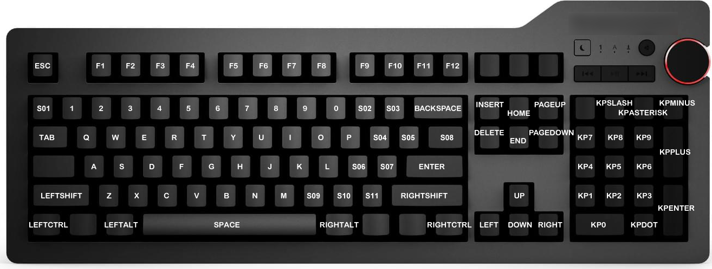
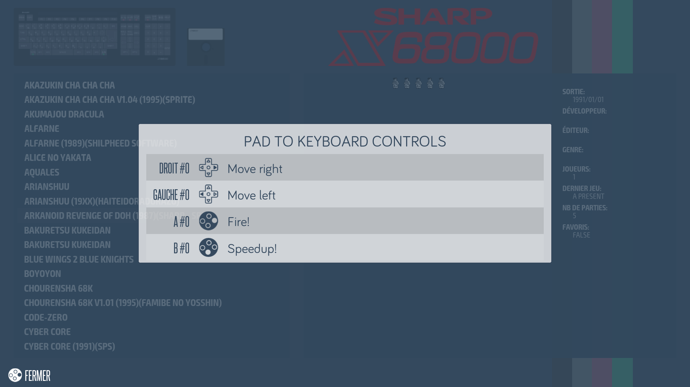

# Pad To Keyboard


>**Recalbox 7.0 et superieur!**
{.is-warning}

Sous ce nom barbare se cache un module qui tient particulièrement à cœur l'un de nos développeur, puisqu'il va permettre de **redonner vie à tous ces jeux d'ordinosaures**, oubliés de tous les Recalboxers qui n'ont pas de clavier branché, c'est a dire, presque tout le monde...

## Du Pad au Clavier...

Durant la glorieuse décennie des 80', nombre de micro-ordinateurs on vu le jour... Mais a cette époque, le Pad n'existe pas encore, et le Joystick n'est pleinement exploité que sur console.  
Les jeux sur micro-ordinateur ont une ergonomie orientée clavier, et pour les plus chanceux clavier ou joystick. Souvent, le clavier est nécessaire pour passer l'intro ou pour démarrer le jeu.  
Il était donc impossible de profiter de ces jeux sans avoir un clavier connecté.

Du moins jusqu'à Recalbox 7.0, qui inclue un module Pad-To-Keyboard qui est chargé de mapper des actions pads vers des appuis/relâchements de touches clavier!  
Ce module permet à l'aide de petits fichiers de configuration très simples, de mapper les actions d'un pad sur les touches d'un clavier. J'en vois certains au fond qui me regardent avec des yeux dubitatifs...

C'est très simple :

* Vous avez un jeu génial sur Commodore 64, mais vous ne pouvez pas y jouer parce qu'il demande d'appuyer sur une touche pour lancer une partie ? Aucun soucis :
  * Mappez le bouton START de votre pad sur la touche ESPACE, et le problème est réglé.
  * Lancez le jeu, appuyez sur START et le jeu verra que vous avez appuyé sur la touche espace d"un clavier. 
* Vous avez un jeu sur Amstrad qui se joue avec les 4 touches fléchées et la barre espace? Pas de problème :
  * Mappez la croix directionnelle de votre pad sur les 4 flèches, le bouton A sur ESPACE.
  * Et jouez à votre jeux comme s'il avait toujours été fait pour un joystick!

Et nul doute que de talentueux développeurs externes pourront même nous faire une petite interface pour créer ces configurations sans effort.

### Comment ça marche?

Lorsqu'il détecte une configuration _**P2K**_ \(Pad to Keyboard\) _****_pour un jeu, EmulationStation va créer un clavier virtuel qui sera vu par le système comme un vrai clavier physique. Tout au long de la session de jeu, EmulationStation va intercepter les événements des pads, et en fonction de la configuration, il va générer des appuis et des relâchements de touches.

Les émulateurs qui sont à l'écoute du clavier vont alors utiliser ces événements clavier dans la machine qu'ils émulent, comme s'ils venaient d'un clavier physique.

### Et l'input-lag?

_**Garantie 100% sans input-lag, et ça fonctionne sur tous les ordinosaures !**_

Le module P2K est en priorité haute, ce qui signifie qu'il prends la main dés qu'un événement pad survient, pour le traduire et le renvoyer vers le clavier virtuel instantanément.

Sur Raspberry Pi3, les mesures effectuées entre la réception de l'action Pad et la réception de l'appui clavier donnent des résultats très inférieurs à ce qui pourrait générer le moindre input lag.

### Ce qu'on ne peut pas encore faire

Pour l'instant, le mapping est un mapping instantané 1 pour 1. C'est à dire que les actions du pad sont traduites instantanément en appui/relâchement d'une seule touche clavier.

On ne peut donc pas:

* Générer un appui multi-touche: SHIFT + une autre touche pas exemple.
* Générer des appuis/relâchements consécutifs pour taper plusieurs caractères: On ne peut pas simuler la frappe d'un mot par exemple.

Ça viendra peut-être dans les prochaines versions 😉 

## Configuration

### Fichier de configurations

Les fichiers de configuration d'un mapping pad-to-keyboard peuvent être définis pour un repertoire complet \(et ses sous-répertoire\) ou pour un jeu en particulier.

Pour un répertoire, il devra se situer à l’intérieur du répertoire et s’appellera: **`.p2k.cfg`**   
Ce qui donnera un chemin final du type: **`/path/to/.p2k.cfg`**

Pour une rom \(ou un jeu\) donné, il devra porter le même nom que la rom, avec l'extension **`.p2k.cfg`** rajouté à l'extension existante.  
Ce qui, pour **`/path/to/mygame.ext`**, donnera au final: **`/path/to/mygame.ext.p2k.cfg`**

Les configurations de répertoires sont actives pour tous les jeux du repertoire et des sous repertoires.

Si plusieurs fichiers sont présents, ils se surchargent dans l'ordre descendant des repertoires, jusqu'à la configuration propre aux jeu si elle existe. Ce sera vu en detail un peu plus loin.

### Configuration du mapping

Partons d'un exemple, utilisé lors des tests:

```text
# dpad to arrow keys
0:up = up
0:down = down
0:right = right
0:left = left

# button A to SPACE
0:a = space
# B to Y key (for Y/N prompts)
0:b = y
# And finally, map START button to ENTER 
0:start = enter
```

Comme on peut le voir, la structure est très simple.

On peut laisser des lignes vides pour séparer les blocs, et utiliser \# en début de ligne pour les commentaires/descriptifs/memos.

Les lignes de configuration de mapping sont de la forme: **`PAD:ACTION = KEY`** , avec:

* **`PAD`**: N° de pad tel que défini dans EmulationStation, ou l'ordre naturel des pads s'ils n'y a pas d'affectation forcée. Rares sont les cas ou plus d'un pad sera mappé, donc le n° **0** sera utilisé dans la grande majorité des cas.
* **`ACTION`**: Action du pad à mapper. On peut mapper tous les boutons, le DPad, et les 4 directions primaires des joysticks analogiques, ce qui représente 25 actions qu'on peut affecter à des touches clavier, sur un pad standard complet.
* **`KEY`**: La touche du clavier qu'on associe à l'action du Pad. Lorsque l'action pad est enclenchée, la touche correspondante est appuyée. Lorsque l'action pad est dés-enclenchée, la touche correspondante est relâchée. Comme vu plus haut, le mapping est du 1 pour 1. Si vous voulez simuler par exemple _**LEFT-SHIFT + A**_, il faudra affecter _**LEFT-SHIFT**_ a un bouton pad \(disons _**L1**_\), et la touche _**A**_ à un autre bouton \(disons le bouton _**Y**_\). L'appui simultané de _**L1+Y**_ donnera un _**LEFT-SHIFT + A**_. Une exception existe pour les Joystick analogiques. Étant donné qu'on peut les placer en diagonale, cette particularité peut être utilisée pour appuyer 2 touches en même temps. 

La casse des **`ACTION`** et **`KEY`** n'a pas d'importance, pas plus que les espaces en début de ligne, en fin de ligne, ou autour du **`=`**

#### Actions joysticks

Voici la liste complète des actions pad utilisables:

| Action | Description | Action | Description |
| :--- | :--- | :--- | :--- |
| **`up`** | Digital PAD, direction haute | **`j1up`** | Joystick \#1 \(gauche\), direction haute |
| **`down`** | Digital PAD, direction basse | **`j1down`** | Joystick \#1 \(gauche\), direction basse |
| **`left`** | Digital PAD, direction gauche | **`j1left`** | Joystick \#1 \(gauche\), direction gauche |
| **`right`** | Digital PAD, direction droite | **`j1right`** | Joystick \#1 \(gauche\), direction droite |
| **`a`** | Bouton A | **`j2up`** | Joystick \#2 \(droite\), direction haute |
| **`b`** | Bouton B | **`j2down`** | Joystick \#2 \(droite\), direction basse |
| **`x`** | Bouton X | **`j2left`** | Joystick \#2 \(droite\), direction gauche |
| **`y`** | Bouton Y | **`j2right`** | Joystick \#2 \(droite\), direction droite |
| **`l1`** | Bouton L1 | **`l2`** | Bouton L2 |
| **`r1`** | Bouton R1 | **`r2`** | Bouton R2 |
| **`start`** | Bouton START | **`l3`** | Bouton L3 |
| **`select`** | Bouton SELECT | **`r3`** | Bouton R3 |
| **`hotkey`** | Bouton HOTKEY |  |  |

#### Touches claviers utilisables

Le clavier virtuel créé par EmulationStation est un clavier agnostique. Il ne connait ni langue, ni layout particulier.  
C'est donc un clavier 105 touches, QWERTY des plus basique.

Pour ne pas perdre les utilisateurs, seules certaines touches communes à tous les claviers sont configurables. Et ce, pour deux bonnes raisons:

* Si je vous dis que sur mon clavier portugais, j'ai mappé le bouton Y sur la touche %, il y a toute les chances qu'elle ne corresponde pas à la touche % sur votre clavier.
* L’émulateur va lui aussi devoir mapper un clavier 105 touche vers le clavier de la machine émulée. C'est parfois tellement complexe et peu intuitif que certains émulateurs proposent en plus un clavier virtuel à l'écran.

Cependant, pas d'affolement, dans la grande majorité des cas, vous allez utiliser des mapping de touches simples. Il faut juste garder en tête que la disposition des lettres est en QWERTY.

Une image vaut mieux qu'un long discours:



#### Surcharge des configurations \(oui, encore!\)

Comme évoque plus haut, les fichiers de configurations, lorsqu'il y en a plusieurs à différents étages de répertoires et/ou pour le jeu lui même, se surchargent les uns les autres.

Le module P2K va commencer par lire celui le plus haut, puis va descendre jusque dans le répertoire de la rom en lisant tous les fichiers de configuration qu'il trouvera, pour finir avec celui de la rom, s'il existe.

Ce qui signifie, que les configurations peuvent s'ajouter, ou se modifier!

**Exemple 1: Les configuration s'additionnent**

**/path/to/.p2k.cfg :**

```text
# Map START to ENTER
0:start = enter
```

**/path/to/mygame.ext.p2k.cfg :**

```text
# Map SELECT to SPACE
0:select = space
```

Donnera l’équivalent de:

```text
# Map START to ENTER
0:start = enter
# Map SELECT to SPACE
0:select = space
```

**Exemple 2: Les configurations se modifient**

**/path/to/.p2k.cfg**

```text
# Map START to ENTER
0:start = enter
# Map SELECT to SPACE
0:select = space
```

**/path/to/mygame.ext.p2k.cfg :**

```text
# Map SELECT to F1
0:select = f1
```

Donnera l’équivalent de :

```text
# Map START to ENTER
0:start = enter
# Map SELECT to F1
0:select = f1
```

**Exemple 3: Les configurations se modifient en supprimant des mappings**

**/path/to/.p2k.cfg**

```text
# Map START to ENTER
0:start = enter
# Map SELECT to SPACE
0:select = space
```

**/path/to/mygame.ext.p2k.cfg :**

```text
# Remove SELECT mapping!
0:select =
```

Donnera l’équivalent de :

```text
# Map START to ENTER
0:start = enter
```

### 

### Ajout d'une description brève



Pou ajouter une description comme ci-dessus.

* Utilisez deux points virgules pour que ça apparaisse.

```text
# Recalbox's Pad-to-Keyboard configuration
#Arkanoid Revenge of Doh (1987)(Sharp - SPS)
#SHARP X6800

#left move key 4
0:left = kp4 ;; Move left
#right move key 6
0:right = kp6 ;; Move right
#shoot key space
0:a = space ;; Fire!
#hispeed move key shift
0:b = leftshift ;; Speedup!
```

##  Section spéciale pour partagez vos configuration

Çà y est, vous avez configuré vos jeux favoris pour qu'ils soient totalement jouables au pad?  
Pensez aux autres et partagez!

Alors ne laissez pas les autres refaire le même travail encore et encore : partagez vos configuration!  
Nous avons ouvert un thread spécial [**ici sur le forum de Recalbox**](https://forum.recalbox.com/topic/21287/partager-vos-fichiers-pad2keyboard-p2k-cfg?_=1600282719468), afin que chacun partage ses configurations.

Attention cependant. Essayez de rester logique, et d'avoir un mapping qui soit au maximum intuitif:

* Un jeu doit se lancer avec START ou le bouton A.
* Si un jeu nécessite une action clavier pour configurer le joystick \(souvent le cas sur ZX Spectrum par exemple\), restez en clavier et faite un mapping complet de toutes les touches.

Bon jeux!

