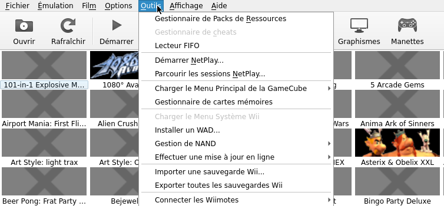
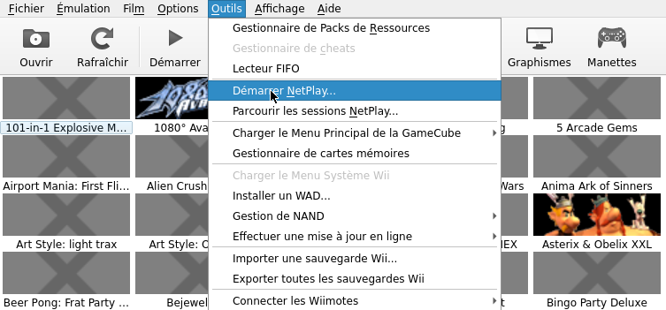
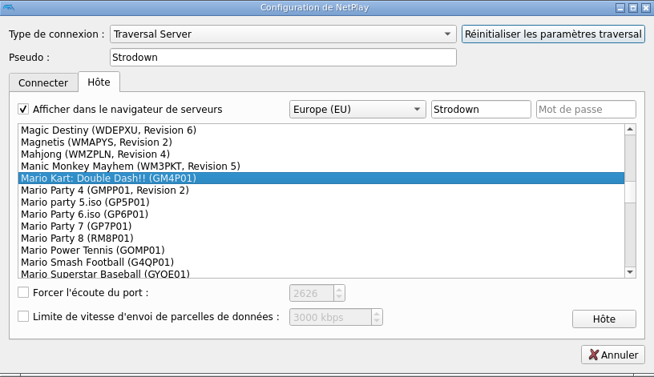
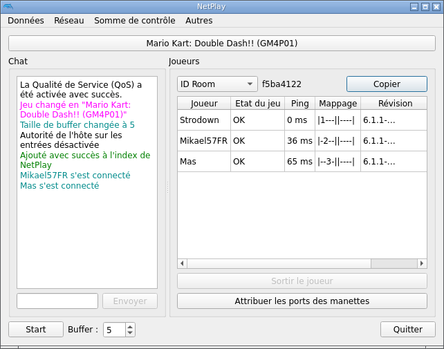
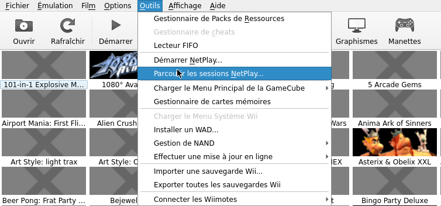
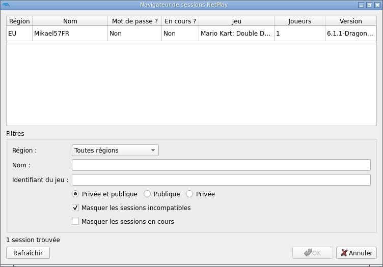
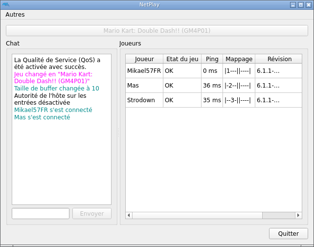

# Notice Netplay Dolphin

>Attention afin de jouer en ligne a la Gamecube quelques configurations sont requises ainsi qu'un clavier et une souris.
{.is-warning}

## Accéder au menu Netplay 

* Lancez n'importe quel jeux de Gamecube ou de Wii.
* En jeu appuyer sur `HOTKEY+B` pour accéder au menu Dolphin.
* Dans le menu a l'aide votre souris appuyer sur l'onglet `Outils` .

###   1. Créer un salon de jeux 

* Appuyer sur `Démarer Netplay...`

* Appuyer sur l'onglet `hôte`, enfin sélectionner votre jeux dans la liste.

* Une fenêtre de chat textuel apparaît et votre salon est désormais joignable patienter !

>Dans la plupart des jeux, ajoutez environ 1 Buffer par 15 ms de latence par client.
{.is-danger}

>Deux joueurs avec une latence de 50 ms représentent environ 3 à 4 Buffer, tandis que trois joueurs avec une latence de 50 et 65 ms représentent environ 7 Buffer.
{.is-success}

* Pour démarrer le jeu appuyez sur `Start` !

###   2. Rejoindre un salon de jeux

* Appuyer sur `Parcourir Les Sessions NetPlay`.

* Dans le lobby Netplay de Dolphin vous pouvez apercevoir toutes les parties en ligne

* Puis double clics sur le salon pour accéder au chat textuel.
* Patientez le lancement du jeu par l'hôte dans le salon de jeu !

