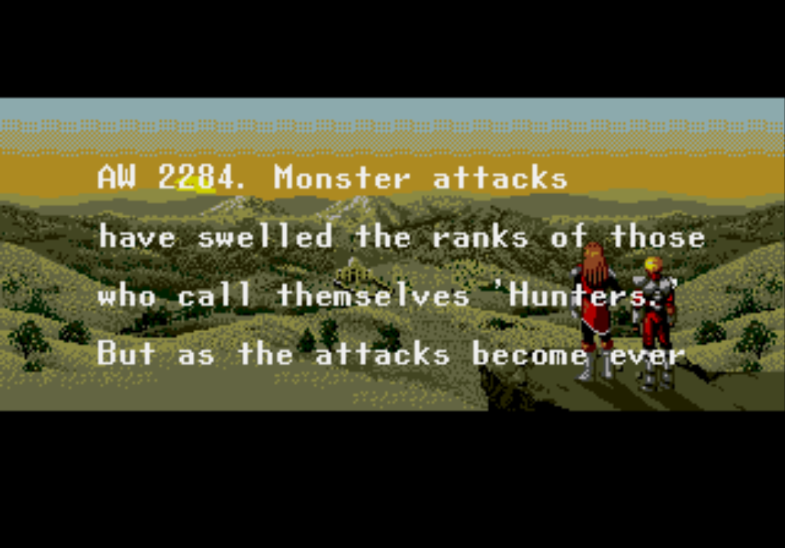
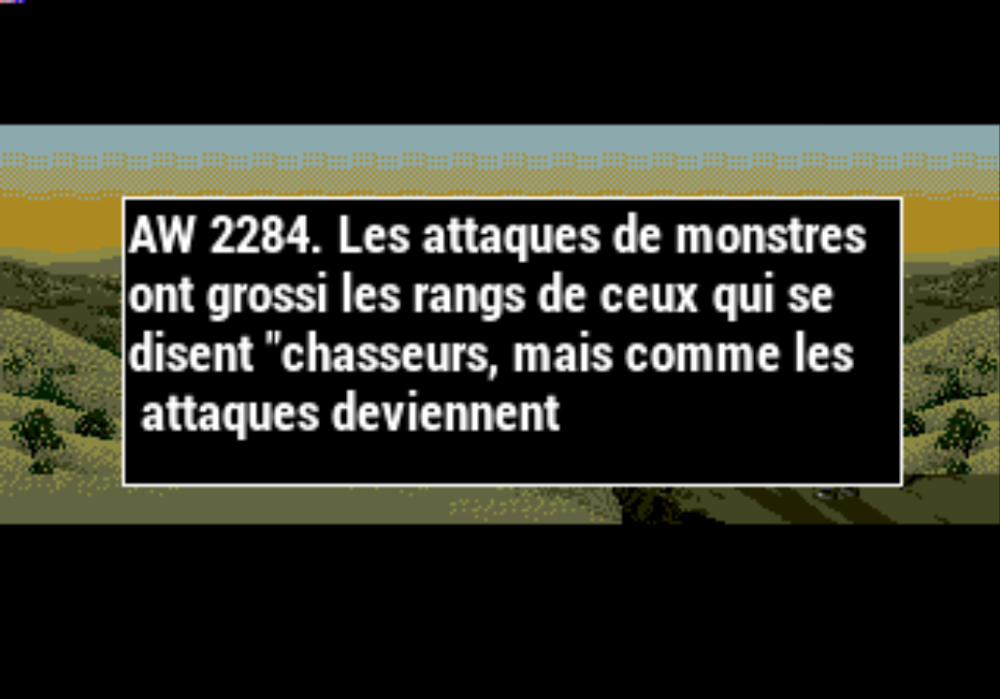

# Retroarch AI \(Traduction en jeu\)

## Retroarch AI, c'est quoi ?

Bienvenue dans le futur ! 

Depuis quelque temps, RetroArch permet l'utilisation d'un service de traduction dit "[**OCR**](/v/francais/usage-basique/glossaire)**"** \(Reconnaissance Optique de Caractères\) et de la **Synthèse Vocale,** ce qui va vous permettre de traduire vos jeux étrangers quasiment instantanément !

>Cette fonction nécessite une connexion internet !
{.is-danger}

## Configuration :

Vous le savez bien, tout est mis en œuvre pour que la configuration de ce genre de service soit le plus simple possible. 

>Ce service nécessite l'inscription à une API.
>
>Recalbox va utiliser par défaut [Ztranslate.net ](https://ztranslate.net/), mais d'autre API peuvent être configurées !
{.is-warning}

* Une fois inscrit et connecté au site, rendez vous dans la section settings pour récupérer votre `API KEY`
* Ouvrir votre fichier `recalbox.conf`
  * Chercher la ligne `;global.translate.apikey=YOUR_API_KEY_HERE`
  * Supprimer le `;`en début de ligne puis coller votre `API KEY` a la place de `YOUR_API_KEY_HERE`

>Recalbox va détecter automatiquement la langue de votre jeu et traduire dans la langue paramétrée depuis le menu principal.
{.is-success}

## C'est parti !

Faites vous plaisir et oublier la frustration lancer un jeu 100 % japonais 😆

* Pour activer la traduction rien de plus simple`HOTKEY + JOYSTICK-GAUCHE BAS` , le jeu est mis en pause et vous montre une image avec le texte de remplacement. 
* Appuyez de nouveau sur la touche de raccourci AI Service pour reprendre le jeu.

 Par défaut Recalbox utilise le mode image plutôt que la synthèse vocale pour utiliser cette dernière une simple [surcharge de configuration ](/v/francais/usage-avance/surcharge-de-configuration/surcharges-retroarch)!

