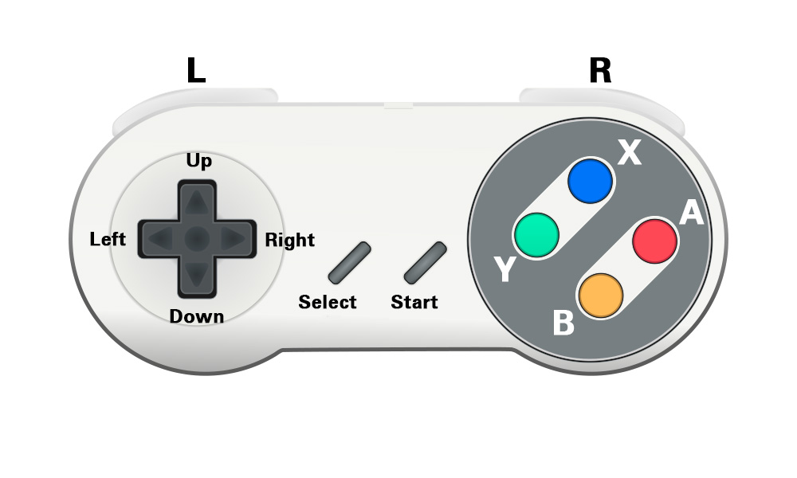
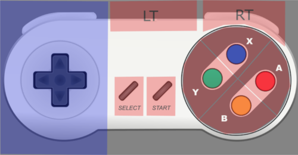

# Première utilisation et configuration

## I - Premiers pas

### 1 - Premier démarrage

* Après l’installation, la première chose à faire est de connecter la Recalbox au téléviseur via le câble HDMI.
* Pour alimenter et démarrer la Recalbox, il suffit de brancher le câble d’alimentation micro USB.

>**Information :**  
>Beaucoup de contrôleurs fonctionnent directement lors de la première utilisation de Recalbox.  
>Cependant si vous voulez configurer directement un contrôleur USB, branchez un clavier USB, ... veuillez consulter "[**II -Configuration d'un contrôleur**](/fr/usage-basique/premiere-utilisation-et-configuration)**".**
{.is-info}

### 2 - Basculer Recalbox en Français

* Sur l'écran de sélection des systèmes, appuyez sur **START.**
* Choisir "_SYSTEM SETTINGS_".
* Puis "_LANGUAGE_".
* Sélectionnez "_FRANÇAIS_".
* Et enfin "_CLOSE_".
* Recalbox va redémarrer automatiquement. Une fois le démarrage terminé, les menus seront en français.

###  3 - Arrêter Recalbox

* Sur l'écran de sélection des systèmes, appuyez sur **START.**
* Choisir “_QUITTER_ ”.
* Puis “_ÉTEINDRE_ ”.
* Attendez que la LED verte/orange du Pi cesse de clignoter afin de ne pas endommager la carte µSD.
* Débranchez le câble d’alimentation.

>**Raccourci** :  
>Sur l'écran de sélection des systèmes, appuyez sur **SELECT** pour accéder directement au menu d'extinction.
{.is-success}

### 4 - Jeux par défaut

Recalbox est livré avec quelques jeux libres de droits \(homebrew\) pour plusieurs systèmes.

## II - Configuration d'un contrôleur

### 1 - Ajouter et configurez un contrôleur USB

Vous pouvez ajouter des contrôleurs USB sur Recalbox.  
La plupart des modèles sont compatibles \(Voir la [**liste de compatibilité**](/hardware-compatibility/compatible-devices/controller)​\).

* Après avoir branché votre contrôleur USB \(ou appairé votre contrôleur Bluetooth\).
* Appuyez sur **START** avec un contrôleur déjà configuré \(ou "**Entrée"** sur un clavier\).
* Sélectionnez "**RÉGLAGES MANETTES**" et suivez les instructions.

* Sélectionnez "**CONFIGURER  MANETTES**" et suivez les instructions.

* Appuyer sur une touche pour commencer la configuration.

* Maintenez un bouton sur la manette pour la configurer.

* Vous pouvez maintenant assigner les boutons de votre manette.

Les noms utilisés pour assigner les boutons sont ceux du contrôleur Super Nintendo : ​

>Les boutons L1, R1, L2, R2, L3 et R3 sont basés sur le contrôleur Playstation.
{.is-info}

>**HOTKEY**
>
>Le dernier bouton à configurer, **HOTKEY,** est celui qui servira à activer les [**commandes spéciales**](/fr/usage-basique/premieres-notions/commandes-speciales) lorsque l'on est dans un émulateur :
>
>* Pour les contrôleurs Xbox 360 et Xbox One, le bouton _Hotkey_ est assigné au bouton _HOME._
>* Pour les contrôleurs Ps3 et PS4, le bouton _Hotkey_ est assigné au bouton _PS._
>* S'il n'y a pas de dédié ou non encore assigné, il est recommandé d'assigner _Hotkey_ au bouton _Select_ ou _L3_ \(Clic du joystick gauche\).
{.is-warning}

>Pour passer n'importe quel bouton \(sauf _Hotkey_\), pressez _Bas_ pour passer au bouton suivant.
{.is-info}

>* Pour les contrôleurs à 6 boutons \(SNES, arcade, ...\), les boutons sont assignés en correspondance avec le contrôleur SNES \(voir ci-dessus\).
>* Pour les contrôleurs à 2 boutons \(NES, PC Engine, Gameboy, ...\), les boutons assignés sont A et B.
{.is-warning}

### 2 - Assignation du contrôleur

* De retour sur l'écran de configuration, vous pouvez assigner le contrôleur à un joueur.
* Sélectionner **"Joueur 1"** afin de lui assigner un contrôleur.

* Sélectionner un contrôleur.

* Votre contrôleur est maintenant configuré.

### 3 - Utiliser un clavier

Si vous n'arrivez pas à configurer votre contrôleur, vous pouvez brancher un clavier USB filaire à Recalbox pour le configurer.

* **START** = _ENTRÉE_
* **SELECT** = _ESPACE_
* **Retour** = _S_
* **Valider** = _A_

\_\_

### 4 - Contrôleur PS3

Pour **associer** un contrôleur PS3 :

* Connectez d’abord le contrôleur au port USB \(via un câble adapté\)
* Puis attendez 10 secondes.
* Après cela, vous pouvez déconnecter le contrôleur
* Puis appuyez sur le bouton **PS** pour lancer la connexion sans fil.

>**Remarque :**  
>Pour les copies asiatiques de la PS3 Dualshock 3 \(comme GASIA ou SHANWAN\), vous aurez besoin d’ajuster quelques paramètres.  
>Voir \[\[PS3 controllers drivers\|PS3-controllers-drivers-\(EN\)\]\]
{.is-warning}

>**Attention :**  
>En cas de doute sur l’alimentation et de la consommation d’énergie, il vaut mieux éviter de charger le contrôleur PS3 sur le Raspberry Pi car cela peut causer des problèmes de stabilité.
>
>Veuillez branchez le contrôleur sur le Pi uniquement pour associer votre contrôleur à votre Recalbox.
{.is-danger}

Si vous comprenez les paramètres impliqués ou voulez utiliser le contrôleur avec une connexion USB :

* vous devez désactiver le pilote bluetooth PS3 dans recalbox.conf en définissant `controllers.ps3.enabled=0`

Rappelez-vous que la configuration des contrôleurs dans Recalbox est basée sur la configuration des boutons SNES :

| Manette PS3 | Manette SNES |
| :---: | :---: |
| X | B |
| ◯ | A |
| ⬜ | Y |
| △ | X |

>**Information :**  
>Par défaut, **HOTKEY** est associé au bouton **PS** \(celui au milieu du contrôleur\).  
>Pour plus d'information sur HOTKEY, voir [Commandes spéciales](/fr/usage-basique/premieres-notions/commandes-speciales).
{.is-info}

### 4 - Contrôleur Xbox 360 

>**Remarque :**  
>Les contrôleurs sans fil Xbox 360 ont besoin d'un dongle de réception sans fil spécifique.
{.is-warning}

Rappelez-vous que la configuration des contrôleurs dans Recalbox est basée sur la configuration des boutons SNES :

| Manette Xbox 360 | Manette SNES |
| :---: | :---: |
| A | B |
| B | A |
| X | Y |
| Y | X |

>**Information :**  
>Par défaut, **HOTKEY** est associé au bouton **HOME** \(celui au milieu du contrôleur\).  
>Pour plus d'information sur HOTKEY, voir [Commandes spéciales](/fr/usage-basique/premieres-notions/commandes-speciales).
{.is-info}

### 5 - Ajouter un contrôleur Bluetooth

Pour ajouter un contrôleur Bluetooth :

* Mettez votre contrôleur en mode _appairage_.
* Ensuite, appuyez sur **START** et choisissez _RÉGLAGE MANETTES_
* Puis _ASSOCIER UNE MANETTE BLUETOOTH_.

Une **liste de contrôleurs** détectés apparaît !

* Il suffit de sélectionner le vôtre et votre contrôleur est appairé. 
* Vous pouvez maintenant le configurer \(s'il n’est pas déjà supporté par Recalbox\).

>**Information :**  
>Pour les contrôleurs **8bitdo**, voir [**8bitdo sur Recalbox**](/fr/compatibilite-materiels/compatibilite-des-peripheriques/8bitdo-sur-recalbox)**.**
{.is-info}

### 6 - Contrôleur GPIO

* Vous pouvez connecter vos boutons et joysticks arcade directement sur les GPIO du Raspberry Pi \(Voir[ **Les contrôleurs GPIO**](/fr/tutoriels/controleurs/gpio/les-controleurs-gpio)\)
* Vous pouvez également connecter des manettes originales de PSOne, Nes, Snes, Megradrive , ... \(Voir **contrôleurs DB9** et **contrôleurs Gamecon**\).

### 7 - Virtual gamepads

 Avec le projet de Miroof Virtual Gamepads vous pouvez ajouter jusqu'à 4 manettes avec vos smartphones/tablettes !

* Démarrez le navigateur web de votre smartphone
* Puis tapez l'adresse IP de votre Recalbox suivie du port de communication \(port=8080\). 

>**Information :**  
>Vous pouvez trouver l'adresse IP de votre Recalbox dans le menu **OPTIONS RÉSEAU**
{.is-info}

## III - Utilisation d'un stockage externe

>**Information :**  
>Vous pouvez très facilement **utiliser un périphérique USB de stockage** \(clé USB, disque dur externe auto alimenté etc.\) pour stocker vos roms, fichiers perso etc...
>
>**Avec cette méthode**, le **système** \(sur la carte sd\) et la **partition share** \(sur le périphérique\) **sont séparés.**  
>  
>Donc ****si vous deviez **réinstaller votre système**, vous **conserveriez toutes vos données utilisateur.**   
>Vous n'aurez alors qu'à **rebrancher votre périphérique** à votre Recalbox, puis **le sélectionner dans le système, et jouer.**
{.is-info}

### 1 - Le format de votre support

Premièrement, vous devez utiliser **un périphérique utilisant un système de fichiers** suivant : **FAT32, EXFAT, EXT4 ou NTFS.** 

>**Attention :**
>
>Les taux de transferts peuvent **être lents** dans le cas du **NTFS.**  
>Soyez également certain que **le système de fichier** que vous choisirez **soit bien compatible avec le système d'exploitation de votre PC.**
{.is-danger}

<table>
  <thead>
    <tr>
      <th style="text-align:center">Formats</th>
      <th style="text-align:center">Taille maximale du volume</th>
      <th style="text-align:center">Taille maximale d&apos;un fichier</th>
      <th style="text-align:center">Nombre maximal de fichiers</th>
      <th style="text-align:center">Mode Lecture/Ecriture</th>
    </tr>
  </thead>
  <tbody>
    <tr>
      <td style="text-align:center">Fat</td>
      <td style="text-align:center">
        
<b>2 Tio</b>
        

        
&lt;b&gt;&lt;/b&gt;

      </td>
      <td style="text-align:center">
        
<b>4 Gio</b>
        

        
<b>4</b>,2949<b> Go</b>
        

      </td>
      <td style="text-align:center">Sup&#xE9;rieur &#xE0; <b>250 millions</b>
      </td>
      <td style="text-align:center">
        <ul>
          <li>Windows : &#x2705;
             
          </li>
          <li>Linux : &#x2705;</li>
        </ul>
      </td>
    </tr>
    <tr>
      <td style="text-align:center">NTFS</td>
      <td style="text-align:center">
        
<b>256 Tio</b>
        

        
<b>2 815</b>,8492 <b>To</b>
        

      </td>
      <td style="text-align:center">
        
<b>16 Tio</b>
        

        
<b>17</b>,5921 <b>To</b>
        

      </td>
      <td style="text-align:center"><b>4 294 967 295</b>
      </td>
      <td style="text-align:center">
        

        <ul>
          <li>
            
Windows : &#x2705;

            

          </li>
          <li>Linux : &#x2705;</li>
        </ul>
      </td>
    </tr>
    <tr>
      <td style="text-align:center">Exfat</td>
      <td style="text-align:center">
        
<b>128 Pio</b>
        

        
<b>144 115</b>,1880 <b>To</b>
        

      </td>
      <td style="text-align:center">
        
<b>128 Pio</b>
        

        
<b>144 115</b>,1880 <b>To</b>
        

      </td>
      <td style="text-align:center"><b>2 796 202</b> par r&#xE9;pertoire</td>
      <td style="text-align:center">
        

        <ul>
          <li>Windows : &#x2705;
             
          </li>
          <li>Linux : &#x2705;</li>
        </ul>
      </td>
    </tr>
    <tr>
      <td style="text-align:center">ext4</td>
      <td style="text-align:center">
        
<b>1 Eio</b>
        

        
<b>1 152 921</b>,5046<b> To </b>(limit&#xE9; &#xE0; 16 Tio par e2fsprogs)

      </td>
      <td style="text-align:center">
        
<b>16 Tio</b>
        

        
<b>17</b>,5921 <b>To</b>
        

      </td>
      <td style="text-align:center"><b>4 milliards</b>
      </td>
      <td style="text-align:center">
        <ul>
          <li>Windows : &#x274C;Lecture/Ecriture via ext2fsd
             
          </li>
          <li>Linux : &#x2705;</li>
        </ul>
      </td>
    </tr>
  </tbody>
</table>

>**Attention :**
>
>RecalboxOS **ne formatera pas** votre périphérique, il ne **créera que de nouveaux fichiers dessus.**
{.is-danger}

### 2 - Configuration

Pour configurer Recalbox pour **utiliser un périphérique de stockage USB.**

* **Branchez votre périphérique** à votre Recalbox, puis **allumez-la.** 
* Une fois **sous l'interface de Recalbox**, **pressez le bouton start** de votre manette, **allez dans les options système** et **dans média de stockage.** 
* Maintenant, **sélectionnez votre périphérique** dans la liste, puis **validez** et **attendez que le système redémarre.**

>**Information :**
>
>**Durant cette phase de redémarrage**, recalboxOS va **créer à la racine** de votre périphérique, **un nouveau répertoire** nommé **"recalbox"** qui contiendra toute l'arborescence de votre **partition "/share".**
{.is-info}

### 3 - Dépannage

#### Disque dur invisible

Que faire si après **le redémarrage Recalbox ne voit toujours pas** le disque dur ?

>**Informations :** 
>
>**Parfois**, après avoir sélectionné **le périphérique dans EmulationStation,** puis **redémarré**, Recalbox **ne parvient pas à créer le système de fichiers** sur celui-ci.  
>Il continue alors d'**utiliser les fichiers de la carte SD.**  
>Cela se produit notamment avec **certains disques durs assez lents à s'initialiser.**
{.is-info}

Ce que vous **pouvez faire**:

* \*\*\*\*[**Connectez-vous en ssh.**](/fr/tutoriels/systeme/acces/acces-root-via-terminal) 
* **Tapez les commandes suivantes :**   `mount -o remount, rw /boot cd / boot nano recalbox-boot.conf`  ****
* **Rajoutez** cette ligne :  `sharewait=30` ****
* **Sauvegardez** par **Ctrl X**`,`**Y**`,`**Entrée.** 
* **Tapez** `reboot` et **validez**, Recalbox **redémarre.**

## **IV - Réseau**

### **1 - Configurer via le câble RJ45**

* Brancher votre câble RJ45 à votre Recalbox.
* Votre Recalbox est configurée.

### **2 - Configurer la Wifi**

* Faites **Start**.
* Options Réseau.
* Pour activer, mettre **On**.
* Configurer le **wifi**, le **nom du réseau**.
  * Saisissez le SSID et la clé de votre réseau wifi avec un clavier. Une fois les informations validées, le wifi sera activé.
* Valider. Une fois Valider, la wifi sera activé. 

Adresse IP, vous permet d'obtenir **l'adresse IP** de votre Recalbox.

