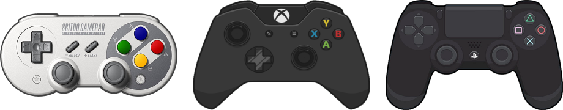

# Pendant le jeu

>Dans Recalbox, les raccourcis sont, pour la plupart, une combinaison de touches impliquant une touche nommée **HOTKEY** \(`HK`\) qui doit au préalable être définie dans les options de réglages de la manette.
>
>Les noms utilisés pour les boutons sont ceux du contrôleur Super Nintendo \(Les boutons `L1`, `R1`, `L2`, `R2`, `L3` et `R3` sont basés sur le contrôleur Playstation\).
>
>Voir "[II - Configuration d'un contrôleur](/fr/usage-basique/premiere-utilisation-et-configuration)" pour plus de détails.
{.is-info}

## Commandes de base

### Retour à la liste de jeux \[Back to Gamelist\]

Quitter le jeu en cours pour retourner à la liste des jeux :

* `HK` + `START`

### Ajouter des crédits \[Insert Coin\].

Ajouter un crédit pour les jeux d’arcade et les jeux NeoGeo :

* `SELECT`

### Relancer le jeu \[Reset\]

Redémarrer le jeu en cours :

* `HK` + `A`

### Rembobiner \[Rewind\]

Faire revenir en arrière le jeu :

* `HK` + `GAUCHE`

### Accélérer \[Fast Forward\]

Avancer rapidement le jeu :

* `HK` + `DROITE`

## Sauvegarde

### Sauvegarder \[Save State\]

Créer un point de sauvegarde dans l’emplacement en cours :

* `HK` + `Y`

### Charger une sauvegarde \[Load State\]

Charger le dernier point de sauvegarde de l’emplacement en cours :

* `HK` + `X`

### Changer l'emplacement de sauvegarde \[Select Slot\]

Sélectionner un emplacement de sauvegarde parmi les 10 emplacements disponibles \(par jeu, numérotés de 0 à 9\) :

* `HK` + `HAUT` ou `BAS` 

## Changer de CD

### Ejecter le CD \[Disk Eject\]

Permet de simuler l'éjection ou insertion d'un CD dans la console \(fonction destinée aux jeux composés de plusieurs CD ou disquettes\) :

* `HK` + `STICK G.` vers le _HAUT_

### Changer de CD \[Disk Swap\]

Sélectionne le disque précédent ou le disque suivant \(fonction destinée aux jeux composés de plusieurs CD ou disquettes\) :

* `HK` + `STICK G.` vers la _GAUCHE_ ou vers la _DROITE_

>Pour résumer simplement comment changer de CD en 3 étapes :
>
>1. _**J’appuie sur Eject et le tiroir s'ouvre :**_
>   * `HK` + `STICK G.` vers le _HAUT_ 
>2. _**Je change de CD \(-1, -2, ... ou +1, +2, ...\) :**_
>   * `HK` + `STICK G.` vers la _GAUCHE_ ou vers la _DROITE_
>3. _**J’appuie sur Eject, le tiroir se referme et je continue le jeu :**_
>   * `HK` + `STICK G.` vers le _HAUT_ 
{.is-success}

## Affichage

### Captures d’écran \[Screenshot\]

Faire une capture de l’écran en cours \(fichier .png enregistré dans le dossier screenshot\) :

* `HK` + `L1`

### Enregistrement vidéo \[Recording\]

Enregistrer une séquence vidéo \(fichier enregistré dans le dossier screenshot\) :

* `HK` + `R3` \(Appui sur `Stick D.`\)

>Le 1er appui lance l’enregistrement et le 2nd stoppe l’enregistrement.
{.is-info}

### Changer le shader \[Shaders Swap\]

Changer le filtre vidéo \(shader\) affiché à l’écran :

* `HK` + `L2` ou `R2`

### Traduire \[Translate\]

Traduire « à la volée » et en surimpression du texte affiché sur l’écran :

* `HK` + `STICK G.` vers le _BAS_

>Nécessite une connexion à Internet pour fonctionner. Plus d'informations sur la page [Retroarch AI \(Traduction en jeu\)](/fr/usage-basique/fonctionnalites/retroarch-ai-traduction-en-jeu)
{.is-danger}

### Afficher les FPS \[FPS Display\]

Afficher le nombre d'images par seconde \(FPS\) actuellement rendu :

* `HK` + `STICK D.` vers le _BAS_

## Utilisateur confirmé

### Accéder au menu RetroArch \[RetroArch Menu\]

Accéder au menu RetroArch :

* `HK` + `B`

>Si vous désirez modifier et sauvegarder la configuration de Retroarch, pensez à activer l'option "**Save settings on Exit**" dans le menu de Retroarch.  
>Une fois cette option activée, **toutes les modifications** effectuées dans ce menu seront sauvegardées avant la sortie du menu.
{.is-info}

## **Retroflag Gpi Case**

