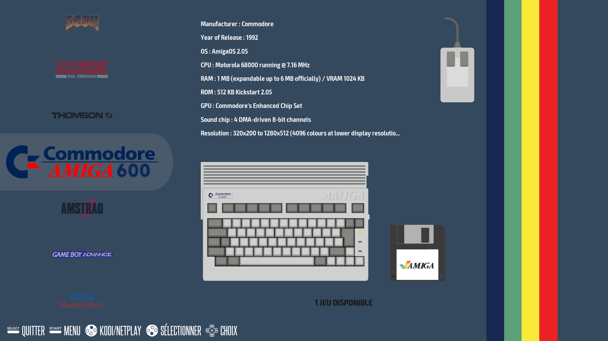
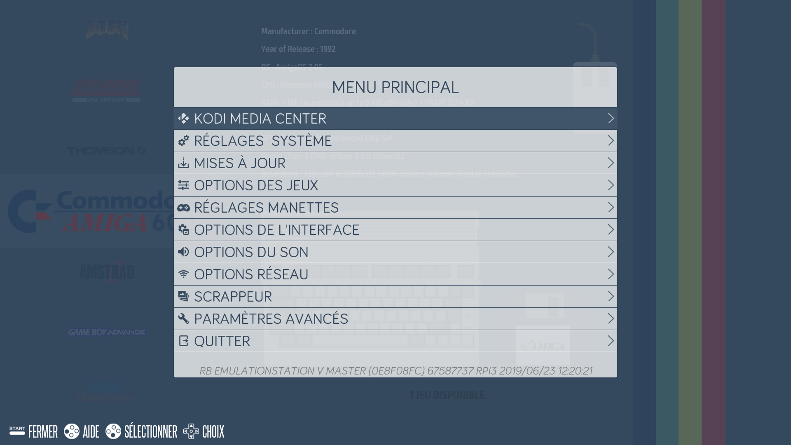

# EmulationStation

## Présentation

>Lorsque vous **allumez la Recalbox**, vous accédez à **l'interface EmulationStation** **\(ES\).**
>
>Celle-ci vous permet de **lancer vos jeux**, de **régler certaines options** ou de **mettre à jour la Recalbox.**
{.is-info}

### **Écran Systèmes**

Le **premier écran** est celui des **Systèmes** :

Il liste les **consoles** et **systèmes disponibles.**

Lorsque vous sélectionnez un système avec la touche A, l'écran change et vous accédez à votre liste de jeux disponibles.

\*\*\*\*

### **Liste des jeux**

Liste les **jeux disponibles** pour **le système sélectionné** à l'écran précédent**.**

Une fois le jeu lancé, reportez-vous à la section **"**[**Pendant le jeu**](/fr/usage-basique/premieres-notions/commandes-speciales/pendant-le-jeu)**"** pour connaître les options disponibles.

## Options dans EmulationStation

En pressant **START**, vous serez en mesure de **modifier certains réglages de Recalbox**.

### Kodi Media Center

* Permet de démarrer **Kodi Media Center** \(aka XBMC\).

>Vous pouvez démarrer Kodi depuis l'écran d'accueil en pressant le bouton **X** de votre manette.
{.is-info}

Pour quitter Kodi, sélectionnez "QUIT" dans le programme, et vous serez de retour sous EmulationStation.

Les manettes sont supportées dans Kodi. Mais si vous préférez, vous pouvez également utiliser le HDMI-CEC \(permet d'utiliser la télécommande de votre TV pour naviguer dans Kodi\) ou une application smartphone de contrôle à distance.

>**Pour plus d'information**s sur **Kodi** :
>
>[**Kodi dans recalbox**](/fr/usage-basique/fonctionnalites/kodi-media-center)  
>****[**Utiliser une télécommande infrarouge**](/fr/usage-basique/fonctionnalites/kodi-media-center/utiliser-une-telecommande-infrarouge)\*\*\*\*
{.is-warning}

### **Réglages Système**

Vous accéderez aux **informations système.**

* **Version de Recalbox** La version de Recalbox actuellement installée. 
* **Stockage**

  Espace de stockage utilisé/disponible.  

* **Media de stockage** 

  Liste les médias de stockage disponible

  * Internal \(1er disque dur utilisé par le système pour le premier boot\)
  * Anyexternal \(tous les disques durs détectés\)
  * External
  * Autre disque dur

* **Langue** La sélection de la langue des menus. 
* **Clavier** Le type de clavier que vous voulez utiliser.

Pour **assigner le Disque Dur** contenant vos roms, sauvegardes et configurations**.**

### Mise à jour

Ce menu propose d'activer ou non les mises à jour et de choisir si on veut installer uniquement une version stable ou aussi les versions bêta de Recalbox.

* Type de mise à jour 
* Lancer la mise à jour

### **Option des jeux**

Ce menu propose comme réglages :

* **Format jeux** :
  * Auto
  * Configuration Retroarch
  * Fourni par le core
  * Ne pas régler
  * Pixel carré
  * Spécifique Retroarch
  * 1/1
  * 16/10
  * 16/15
  * 16/9
  * 19/12
  * 19/14
  * 2/1
  * 21/9
  * 3/2
  * 3/4
  * 30/17
  * 32/9
  * 4/1
  * 4/3
  * 5/4
  * 6/5
  * 7/9
  * 8/3
  * 8/7
  * 9/16 
* **Lisser les jeux** : Permet de donner un petit effet de flou aux pixels pour que se soit plus joli sur nos TV modernes. 
* **Rembobinage** : Vous autorise à effectuer des retours dans le temps lors de votre partie.

>**Attention :**  
>Cela peut ralentir certains émulateurs \(PS1, Dreamcast, ...\) si vous l'activez par défaut sur ces émulateurs.  
>Vous pouvez l'activer seulement pour certains émulateur via le menu [**Paramètres avancés**](emulationstation.md#parametres-avances). 
{.is-danger}

* **Sauvegarde/Chargement auto** : Permet de reprendre une partie là où on l'avait laissé en quittant le jeu. 
* **Appuyer deux fois pour quitter le jeu** : Permet de confirmer que l'on veux bien quitter le jeu en cours. 
* **Réglage des Shaders** :  
  Vous pouvez configurer facilement les _shaders_ pour les différents systèmes.  

  * Les shaders **scanlines** activent les scanlines sur tous les systèmes afin d'obtenir un rendu proche d'un écran CRT. 
  * Les shaders **retro** sont un pack de shaders, correspondant au meilleur shader à appliquer à chaque système. Les shaders composant ce pack, sont choisis par la communauté et vous apporteront l'expérience de jeux la plus proche de l'expérience originale pour chaque système !

  
  Pour plus d'informations, regardez **Configuration des shaders.**

>**Information :**  
>Vous pouvez aussi changer de _shader_ pendant le jeu, en utilisant votre manette.  
>Utilisez les [**Commandes spéciales**](/fr/usage-basique/premieres-notions/commandes-speciales/pendant-le-jeu) **Hotkey + R2** ou **Hotkey + L2** pour voir s'afficher le shader suivant ou précédent.
{.is-info}

* **Intégrer Echelle \(Pixel Parfait\)** : Affiche les jeux dans leurs résolution d'origine. 
* **Options de Retroachievements** : Permet de paramétrer Retroachievements \(Équivalent des succès/trophées mais pour les anciennes consoles\). 
* **Options NetPlay** : Permet de paramétrer le NetPlay \(Jeu en ligne\).

### **Réglages Manettes**

C'est ici que vous pouvez configurer vos manettes.

### **Options de l'interface**

Ce menu propose l'accès aux réglages de l'interface.

* **Screensaver** : Paramétrage de l'économiseur d'écran avec différentes options.
* **Horloge dans le menu**
* **Affichage de l'aide**
* **Réglage des popups**
* **Sélection rapide du système** : Permet de basculer d'un système à l'autre par les touches droite ou gauche.
* **Clavier virtuel**
* **Thème** : Choix des différents thèmes créés par la communauté \(Ces nouveaux thèmes ne sont pas disponibles par défaut avec Recalbox\)

### **Options du Son**

Ce menu propose 

* de désactiver ou activer les **musiques de fond** dans EmulationStation
* Volume Régler le **volume du système**
* - Sélectionner la **sortie audio.**
  * _Auto_
  * _Jack_
  * _HDMI_

>**Information :**  
>Pour forcer la sortie analogique, sélectionnez _Jack_.
{.is-info}

### **Options Réseau**

Ce menu propose 

* Activer Activation du mode réseau de votre Recalbox.
  * On/Off 
* Configurer le **wifi**, le **nom du réseau** 
* Adresse IP Permet d'obtenir **l'adresse IP** de votre Recalbox.

Saisissez le SSID et la clé de votre réseau wifi avec un clavier. Une fois les informations validées, le wifi sera activé.

>**Problème connu** :
>
>Il est impossible de saisir certains caractères spéciaux nécessaires à vos informations réseau.  
>Si vous rencontrez ce souci, configurez alors votre accès wifi directement dans le fichier "`recalbox.conf`".  
>Plus d'information sur **"**[**Le fichier recalbox.conf**](/fr/usage-basique/premieres-notions/le-fichier-recalbox.conf)**"**.
{.is-warning}

### Scrappeur

Pour chaque jeu, vous pouvez obtenir des informations \(pochette, résumé, etc...\) qui seront affichées dans le menu de sélection des jeux de EmulationStation.

Pressez **START** et aller dans _SCRAPPEUR_. Suivez alors les instructions à l'écran.  
Plus d'info sur "[**Scrappeur Interne**](/fr/usage-basique/fonctionnalites/scrapeur-interne)**"**.

### Paramètres avancés

* **Overclock** : Réglages de l'overclocking 
  * _NONE_
  * _HIGH_
  * _TURBO_
  * _EXTREM_\)

>Les réglages Turbo et Extrem peuvent causer des dommages irréversibles au Raspberry s'ils ne sont pas fait dans de bonnes conditions \(Dissipation de chaleur, ventilation, ...\).  
>La garantie de votre matériel peut être annulée.
{.is-danger}

>Le classement des presets d'overclock pour le RPi1, par ordre croissant de vitesse, donne : NONE &lt; HIGH &lt; TURBO &lt; EXTREM
>
>Le réglage Extrem peut annuler la garanti de votre RPi, mais il s'agit du seul qui vous donnera de bonnes performance avec tous les émulateurs du RPi1
{.is-warning}

>Il est également conseiller d'overclocker le RPi2 si vous voulez émuler la N64 et obtenir la meilleur expérience de jeu.
{.is-warning}

* Paramètres de démarrage : Différents paramètres de démarrage. 
* Configuration avancée de l'émulateur : Permet de configurer les options des émulateurs indépendamment des autres. 
* Options Kodi
  * O
* Sécurité : Permet de renforcer la sécurité de Recalbox et de modifier le mot de passe root.
  * O
* Overscan
  * O
* Afficher la fréquence
* Recalbox Manager
  * On/Off
* Recalbox API
  * On/Off

### Quitter

Menu qui permet **d'éteindre Recalbox.**

* Éteindre
* Extinction rapide
* Redémarrage

## Contrôles

#### Les commandes dans l'interface :

* A → Sélectionner
* B → Retour
* Y → Favoris
* X → Démarrer Kodi
* Start → Menu
* Select → Options \(sur l'écran système, ouvre le menu de redémarrage\)
* R → Page Suivante
* L → Page Précédente

## Favoris

Vous pouvez définir un jeu comme favoris en pressant la touche **Y**.  
Le jeu sera alors placé en début de liste avec une ☆ devant son nom.

>**Attention :**  
>Le système doit être **éteint proprement en utilisant le menu de EmulationStation** pour que que la **liste de jeux en favoris soit sauvegardée** et que vous la retrouviez au **prochain démarrage.**
{.is-danger}

