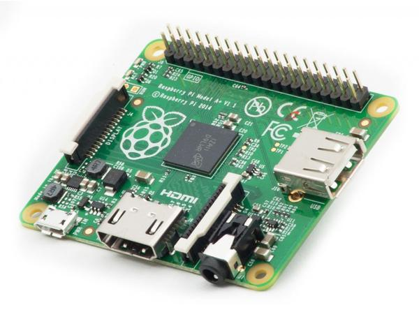
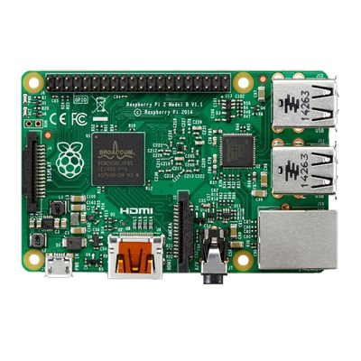
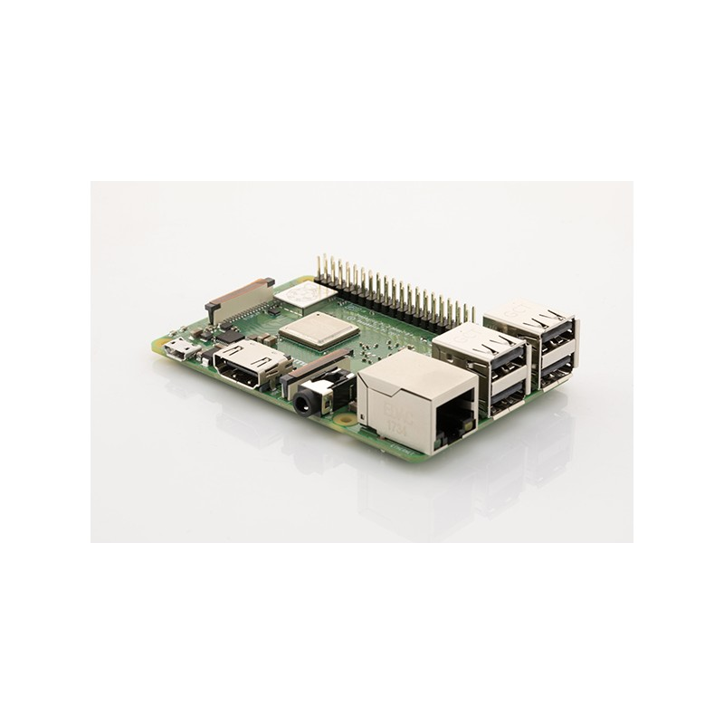

# Raspberry Pi

### ! ! ! Under construction ! ! !

The Raspberry Pi has an ARM11 700 MHz processor. It includes 1, 2 or 4 USB ports, an RJ45 port and 256 MB of RAM for the original model up to 4 GB on the latest versions. Its BMC VideoCore 4 graphics circuitry can decode full HD Blu-Ray streams \(1080p 30 frames per second\), emulate old consoles and play relatively recent video games.

## Additional accessories required

* Power supply
* Case
* SD card

## Raspberry Pi Zero v1.3

The first computer at $ 5!   
The ultra-thin and ultra-thin Raspberry Pi Zero is the smallest Raspberry Pi form factor on the market. It is 40% faster than the original Raspberry Pi but is only 65 mm long by 30 mm wide and 5 mm deep.   
The Raspberry Pi Zero supports mini-connectors to save space and the 40-pin GPIO is unpopulated, which offers the flexibility to use only the connections necessary for your project.   

### Characteristics 

* **CPU :** ARM11, Broadcom BCM2835, Single-core 1GHz 
* **RAM :** 512MB 
* **Storage :** Micro-SD 
* **Connectors :** 
  * 1 X USB for data \(On-The-Go ports\)
  * 1 X Mini HDMI 
  * 1 X Micro-USB power 
  * 1 X CSI \(camera header\) 
  * 40 X Unpopulated pin GPIO connector 
* **Dimensions :** 65mm x 30mm x 5mm

## Raspberry Pi Zero W **\(Wireless\)**

The Raspberry Pi Zero W!   
****It ****is the smallest of the Raspberry Pi family, it also has Wi-Fi and integrated Bluetooth connectivity! With a processor as powerful as the A + and the B +, the Raspberry Pi Zero W will offer you many possibilities, thanks to its compact design.

>**Warning :**   
>You will need a 2x20 GPIO header to connect most of  expansion cards!
{.is-danger}

### Characteristics

* **CPU :** ARM11, Broadcom BCM2835, Single-core 1GHz 
* **GPU :** Integrated
* **RAM :** 512MB \(DDR2\)
* **Connectors :** 
  * 1 X USB for data \(On-The-Go ports\)
  * 1 X Mini HDMI 
  * 1 X Micro-USB power 
  * \(power supply\)
* **Additional :**
  * 1 X CSI \(camera header\) 
  * 40 X Unpopulated pin GPIO connector 
* **Communication :** 
  * Bluetooth 4.1, Bluetooth Low Energy \(BLE\)
  * WIFI 802.11b/g/n Wireless LAN \( 150 Mbps\)
* **Power supply :**
  * 1 X Micro-USB
* **Dimensions :** 65mm x 31mm x 5mm

## Raspberry Pi **1 A+**

The Raspberry Pi 1 Model A+ Is just 56mm long, 12mm thick and uses up to 45% less power than a Raspberry Pi 1 Model B+

### Caract**e**ristics

* **CPU:** 
* **RAM :** 512MB
* **Connectors:**
  * 1 X Micro SD slot
  * 1 X USB
  * 40 X GPIO
* **Network :** None
* **Dimensions:** 65x56x12mm

## Raspberry Pi 2 B

### Caracteristics 

* **CPU :** 900MHz Quad-Core ARM BCM2836 Cortex-A7 CPU
* **GPU :** Dual Core VideoCore IV® Multimedia Co-Processor
* **RAM :** 1 GB
* **Connectors :**
  * 1 X CSI Camera Port \(Video Input\)
  * 40 X GPIO Pins
  * 1 X MicroSD Storage
* **Additional :**
  * Audio/Display Output: HDMI, DSI Display Port, Component over 3.5mm
  * 4 X USB Ports \(USB 2.0\)
* **On-board Network :** 10/100 Mbit/s Ethernet
* **Power supply :** 5V MicroUSB

## Raspberry Pi 3 B 1GB

Discover the **Raspberry Pi 3 Model B 1GB** with **integrated Wi-Fi** and **Bluetooth** connectivity! 

Based on the **Quad Core Broadcom 2837 ARMv8 64bit** processor going from 900MHz \(on Pi2\) to 1.2Ghz, the new generation RPi is a little larger than Pi2, faster and more powerful than its predecessors.

### Caracteristics 

* **CPU :** Broadcom BCM2837 \(ARM Cortex-A53 Quad-Core 1.2 GHz\)
* **GPU :** ARM v8, Dual-Core _VideoCore IV_
* **RAM :** 1GB
* **Connectors :** 
  * 1 X Jack 3,5mm Female Stereo
  * 1 x Hdmi
  * 4 x USB 2.0
  * 1 x micro SD \(SDHC, SDXC\)
  * 1 X RJ45 Female
* **Additional :** 
  * 1 x CSI \(header camera\)
  * 1 x DSI \(header screen\)
  * 40 x ****GPIO
* **Network :** WiFi WLAN BCM43143,  Wi-Fi N 150 Mbps \(IEEE 802.11n\) , Bluetooth BLE 4.1
* **Power supply :** up to 2,5A, Micro USB

## Raspberry Pi 3 B**+** 1GB

**The latest generation of Raspberry Pi 3!** 

The Raspberry Pi 3 Model B + has a **1.4-bit quad-core processor** clocked at 1.4 GHz, a **2.4 GHz and 5 GHz dual-band wireless network**, a **Bluetooth 4.2 / BLE connection**, a faster Ethernet connection and the possibility of a PoE power via PoE HAT \(not included\).

The latest Raspberry Pi 3 model B + has a faster 64 GHz 1.4-bit quad core processor, 1 GB of RAM, a faster 802.11 b / g / n / ac dual-band wireless LAN, Bluetooth 4.2 and an Ethernet 300 Mbit/s much faster. 

With the ARMv8 processor, it can run the full range of ARM GNU / Linux distributions, including Snappy Ubuntu Core, as well as the IoT edition of Microsoft Windows 10. 

* Raspberry Pi 3 Model B + \(B Plus\) with 1.4GHz 64-bit quad-core ARMv8 CPU \(BCM2837B0\) 

### Characteristics 

* **CPU :** Broadcom BCM2837B0 \(ARM Cortex-A53 Quad-Core 1.4 GHz\) / Arm 11 
* **GPU :** Dual Core VideoCore IV® Multimedia Co-Processor Provides Open GL ES 2.0, hardware-accelerated OpenVG, and 1080p30 H.264 high-profile decode 
* **Memory :** 512MB SDRAM 
* **RAM :** 1GB LPDDR2 SDRAM 
* **Connectors :**
  * 1 X Jack 3,5mm Stereo Female 
  * 4 X USB 2.0 
  * 1 X RJ45 Female 
  * 1 x HDMI 
  * 1 x GPIO \(40 pin\) 
  * 1 x micro SD slot \(SDHC, SDXC\) 
  * 1 x Gigabit Ethernet USB 2.0 \(300Mbit / s ethernet\) 
* **Additional :** 
  * 1 x MIPI CSI \(Camera interface\) 
  * 1 x MIDI DSI \(Display interface\) 
  * 1 X GPIO 40 pins \(header\)
* **Network :** 
  * WIFI 2.4GHz and 5GHz IEEE 802.11.b / g / n / ac WLAN \(10/100/1000 Mbps\) 
  * Bluetooth 4.2 HS low-energy \(BLE\) \(CYW43455\) 
* **Power supply :** Micro USB socket 5V, 2A \(PoE compatible requiring PoE HAT not supplied\)

#### 

